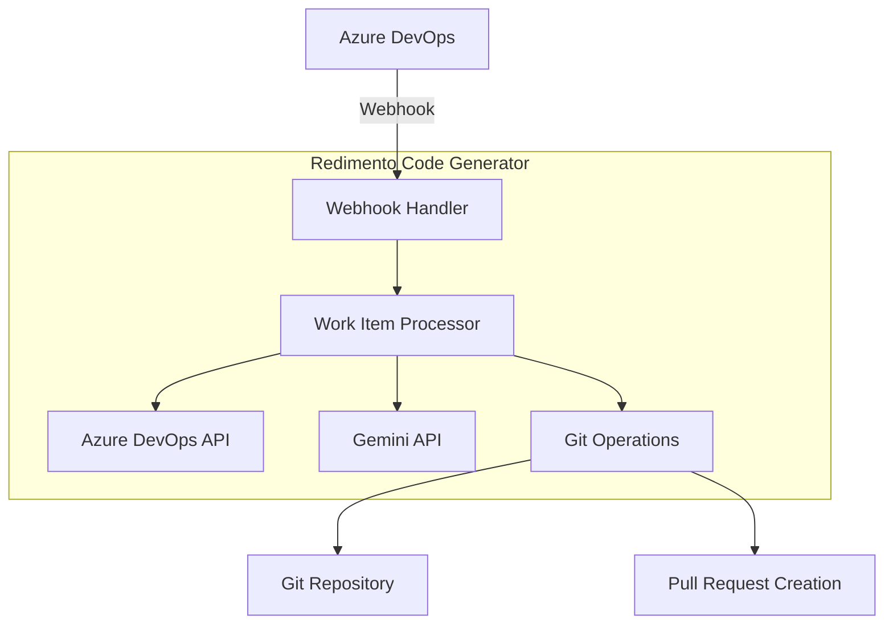

# Documento de Design

## Visão Geral

O Redimento Code Generator é uma aplicação Node.js/TypeScript que automatiza o processo de desenvolvimento de código a partir de work items do Azure DevOps. O sistema utiliza webhooks para receber notificações, processa work items através da API REST do Azure DevOps, gera código usando a API do Google Gemini, e automatiza operações Git para criar branches e pull requests.

A arquitetura segue padrões de separação de responsabilidades com controllers para HTTP, services para lógica de negócio, e uma estrutura modular que facilita testes e manutenção.

## Arquitetura

### Arquitetura de Alto Nível



### Fluxo de Dados Principal

1. **Recepção de Webhook**: Azure DevOps envia webhook quando work item é criado/atualizado
2. **Validação e Processamento**: Sistema valida payload e extrai informações do work item
3. **Enriquecimento de Dados**: Busca detalhes adicionais via Azure DevOps REST API
4. **Geração de Código**: Envia prompts estruturados para Gemini API
5. **Operações Git**: Cria branch, faz commit do código gerado
6. **Pull Request**: Cria PR automaticamente com informações do work item

### Padrões Arquiteturais

- **MVC Pattern**: Controllers para HTTP, Services para lógica de negócio
- **Repository Pattern**: Abstração para operações de dados
- **Factory Pattern**: Criação de processadores específicos por tipo de work item
- **Strategy Pattern**: Diferentes estratégias de geração de código por linguagem
- **Observer Pattern**: Sistema de eventos para monitoramento e logging

## Componentes e Interfaces

### Controllers

#### WebhookController
```typescript
interface IWebhookController {
  handleWorkItemEvent(req: Request, res: Response): Promise<void>;
  validateWebhookSignature(payload: string, signature: string): boolean;
}
```

**Responsabilidades:**
- Receber e validar webhooks do Azure DevOps
- Autenticar requisições usando assinatura HMAC
- Delegar processamento para WorkItemService
- Retornar respostas HTTP apropriadas

#### HealthController
```typescript
interface IHealthController {
  getHealthStatus(req: Request, res: Response): Promise<void>;
  getDetailedStatus(req: Request, res: Response): Promise<void>;
}
```

### Services

#### WorkItemService
```typescript
interface IWorkItemService {
  processWorkItem(workItemData: IWorkItemWebhookPayload): Promise<IProcessingResult>;
  enrichWorkItemData(workItemId: number): Promise<IEnrichedWorkItem>;
  determineTargetRepository(workItem: IEnrichedWorkItem): Promise<IRepositoryConfig>;
}
```

**Responsabilidades:**
- Orquestrar o processamento completo de work items
- Enriquecer dados via Azure DevOps API
- Determinar repositório alvo baseado em configuração
- Coordenar geração de código e operações Git

#### AzureDevOpsService
```typescript
interface IAzureDevOpsService {
  getWorkItem(workItemId: number, fields?: string[]): Promise<IWorkItem>;
  addWorkItemComment(workItemId: number, comment: string): Promise<void>;
  linkPullRequestToWorkItem(workItemId: number, pullRequestId: number): Promise<void>;
  getWorkItemFields(workItemType: string): Promise<IWorkItemField[]>;
}
```

#### GeminiService
```typescript
interface IGeminiService {
  generateCode(prompt: ICodeGenerationPrompt): Promise<IGeneratedCode>;
  validateGeneratedCode(code: string, language: string): Promise<IValidationResult>;
  fixCodeIssues(code: string, issues: ICodeIssue[]): Promise<string>;
}
```

#### GitService
```typescript
interface IGitService {
  createBranch(repositoryPath: string, branchName: string): Promise<void>;
  commitChanges(repositoryPath: string, files: IFileChange[], message: string): Promise<string>;
  pushBranch(repositoryPath: string, branchName: string): Promise<void>;
  createPullRequest(repositoryConfig: IRepositoryConfig, prData: IPullRequestData): Promise<IPullRequest>;
}
```

### Middleware

#### AuthenticationMiddleware
```typescript
interface IAuthenticationMiddleware {
  validateWebhookSignature(req: Request, res: Response, next: NextFunction): void;
  validateApiKey(req: Request, res: Response, next: NextFunction): void;
}
```

#### LoggingMiddleware
```typescript
interface ILoggingMiddleware {
  logRequest(req: Request, res: Response, next: NextFunction): void;
  logError(error: Error, req: Request, res: Response, next: NextFunction): void;
}
```

## Modelos de Dados

### Work Item Models

```typescript
interface IWorkItemWebhookPayload {
  eventType: string;
  publisherId: string;
  resource: {
    id: number;
    workItemType: string;
    url: string;
    fields: Record<string, any>;
  };
  resourceVersion: string;
  resourceContainers: {
    project: {
      id: string;
      name: string;
    };
  };
}

interface IEnrichedWorkItem {
  id: number;
  type: WorkItemType;
  title: string;
  description?: string;
  acceptanceCriteria?: string;
  reproductionSteps?: string;
  assignedTo?: string;
  areaPath: string;
  iterationPath: string;
  state: string;
  priority: number;
  tags: string[];
  customFields: Record<string, any>;
}

enum WorkItemType {
  USER_STORY = 'User Story',
  TASK = 'Task',
  BUG = 'Bug',
  FEATURE = 'Feature',
  EPIC = 'Epic'
}
```

### Code Generation Models

```typescript
interface ICodeGenerationPrompt {
  workItem: IEnrichedWorkItem;
  targetLanguage: ProgrammingLanguage;
  projectContext: IProjectContext;
  codeTemplates: ICodeTemplate[];
  codingStandards: ICodingStandards;
}

interface IGeneratedCode {
  files: IGeneratedFile[];
  tests: IGeneratedFile[];
  documentation: string;
  dependencies: string[];
  buildInstructions: string;
}

interface IGeneratedFile {
  path: string;
  content: string;
  language: ProgrammingLanguage;
  type: FileType;
}

enum ProgrammingLanguage {
  TYPESCRIPT = 'typescript',
  JAVASCRIPT = 'javascript',
  PYTHON = 'python',
  CSHARP = 'csharp',
  JAVA = 'java'
}

enum FileType {
  SOURCE = 'source',
  TEST = 'test',
  CONFIG = 'config',
  DOCUMENTATION = 'documentation'
}
```

### Configuration Models

```typescript
interface IRepositoryConfig {
  id: string;
  name: string;
  url: string;
  defaultBranch: string;
  targetLanguage: ProgrammingLanguage;
  codeTemplates: ICodeTemplate[];
  codingStandards: ICodingStandards;
  reviewers: string[];
  areaPathMappings: Record<string, string>;
}

interface ICodeTemplate {
  name: string;
  workItemTypes: WorkItemType[];
  templateFiles: ITemplateFile[];
  variables: Record<string, string>;
}

interface ICodingStandards {
  lintingRules: string;
  formattingConfig: string;
  namingConventions: Record<string, string>;
  fileStructure: IFileStructureRule[];
}
```

### Git Models

```typescript
interface IPullRequestData {
  title: string;
  description: string;
  sourceBranch: string;
  targetBranch: string;
  reviewers: string[];
  workItemIds: number[];
  labels: string[];
}

interface IFileChange {
  path: string;
  content: string;
  operation: FileOperation;
}

enum FileOperation {
  CREATE = 'create',
  UPDATE = 'update',
  DELETE = 'delete'
}
```

## Tratamento de Erros

### Estratégia de Retry

```typescript
interface IRetryConfig {
  maxAttempts: number;
  baseDelay: number;
  maxDelay: number;
  backoffMultiplier: number;
  retryableErrors: string[];
}

class RetryService {
  async executeWithRetry<T>(
    operation: () => Promise<T>,
    config: IRetryConfig
  ): Promise<T>;
}
```

### Hierarquia de Erros

```typescript
abstract class BaseError extends Error {
  abstract readonly code: string;
  abstract readonly statusCode: number;
  abstract readonly retryable: boolean;
}

class WebhookValidationError extends BaseError {
  readonly code = 'WEBHOOK_VALIDATION_ERROR';
  readonly statusCode = 400;
  readonly retryable = false;
}

class AzureDevOpsApiError extends BaseError {
  readonly code = 'AZURE_DEVOPS_API_ERROR';
  readonly statusCode = 502;
  readonly retryable = true;
}

class GeminiApiError extends BaseError {
  readonly code = 'GEMINI_API_ERROR';
  readonly statusCode = 502;
  readonly retryable = true;
}

class GitOperationError extends BaseError {
  readonly code = 'GIT_OPERATION_ERROR';
  readonly statusCode = 500;
  readonly retryable = true;
}
```

### Error Recovery

- **Webhook Failures**: Retry com backoff exponencial, notificar após 3 tentativas
- **API Failures**: Circuit breaker pattern para APIs externas
- **Git Conflicts**: Geração automática de nomes de branch alternativos
- **Code Generation Failures**: Fallback para templates simples
- **Validation Failures**: Criação de PR como draft com comentários explicativos

## Estratégia de Testes

### Abordagem Dual de Testes

O sistema utilizará uma combinação de testes unitários e testes baseados em propriedades para garantir cobertura abrangente:

**Testes Unitários:**
- Exemplos específicos e casos extremos
- Pontos de integração entre componentes
- Condições de erro e recuperação
- Validação de configurações

**Testes Baseados em Propriedades:**
- Propriedades universais que devem ser mantidas
- Cobertura abrangente de entrada através de randomização
- Validação de invariantes do sistema

### Configuração de Testes Baseados em Propriedades

- **Framework**: fast-check para TypeScript
- **Iterações Mínimas**: 100 por teste de propriedade
- **Tagging**: Cada teste referencia sua propriedade do documento de design
- **Formato da Tag**: **Feature: redimento-code-generator, Property {número}: {texto da propriedade}**

### Estrutura de Testes

```typescript
// Exemplo de estrutura de teste
describe('WorkItemService', () => {
  describe('Unit Tests', () => {
    it('should process User Story work items correctly', () => {
      // Teste específico para User Stories
    });
    
    it('should handle missing description gracefully', () => {
      // Teste de caso extremo
    });
  });
  
  describe('Property Tests', () => {
    it('should maintain work item ID consistency', () => {
      // **Feature: redimento-code-generator, Property 1: Work item ID preservation**
      fc.assert(fc.property(fc.integer(), (workItemId) => {
        // Propriedade universal
      }));
    });
  });
});
```

## Propriedades de Correção

*Uma propriedade é uma característica ou comportamento que deve ser verdadeiro em todas as execuções válidas de um sistema - essencialmente, uma declaração formal sobre o que o sistema deve fazer. As propriedades servem como ponte entre especificações legíveis por humanos e garantias de correção verificáveis por máquina.*

### Property 1: Webhook Processing Consistency
*Para qualquer* work item válido recebido via webhook, o sistema deve processar o payload e extrair informações consistentemente, independentemente do tipo de work item
**Valida: Requisitos 1.2, 2.1, 2.2, 2.3**

### Property 2: Webhook Validation Universality  
*Para qualquer* payload de webhook recebido, o sistema deve validar estrutura e autenticação antes de processar
**Valida: Requisitos 1.3**

### Property 3: Retry Logic Consistency
*Para qualquer* operação que falhe (webhook, API externa, geração de código), o sistema deve implementar retry com backoff exponencial até o limite configurado
**Valida: Requisitos 1.5, 3.5, 10.1**

### Property 4: Work Item Data Sufficiency Validation
*Para qualquer* work item processado, o sistema deve validar se contém informações suficientes para geração de código antes de prosseguir
**Valida: Requisitos 2.4**

### Property 5: Code Generation Template Consistency
*Para qualquer* work item processado, o código gerado deve usar templates específicos do projeto e seguir padrões de codificação configurados
**Valida: Requisitos 3.2, 7.4**

### Property 6: Programming Language Mapping
*Para qualquer* projeto configurado, o sistema deve gerar código na linguagem apropriada baseada na configuração do projeto
**Valida: Requisitos 3.3**

### Property 7: Code Validation Universality
*Para qualquer* código gerado, o sistema deve realizar validação de sintaxe e executar regras de linting configuradas
**Valida: Requisitos 3.4, 7.1, 7.2**

### Property 8: Branch Naming Convention
*Para qualquer* work item processado, o sistema deve criar branch seguindo o padrão `feat/{id}_{titulo_sanitizado}` com identificadores Git válidos
**Valida: Requisitos 4.1, 4.2**

### Property 9: Commit Message Consistency
*Para qualquer* código commitado, a mensagem deve incluir ID do work item, descrição e ser descritiva
**Valida: Requisitos 4.3, 4.4**

### Property 10: Automated Git Operations
*Para qualquer* branch criada com código, o sistema deve fazer push automaticamente para o repositório remoto
**Valida: Requisitos 4.5**

### Property 11: Pull Request Automation
*Para qualquer* código commitado em feature branch, o sistema deve criar pull request automaticamente com detalhes do work item
**Valida: Requisitos 5.1, 5.2**

### Property 12: Work Item Linking
*Para qualquer* pull request criado, deve estar vinculado ao work item original no Azure DevOps
**Valida: Requisitos 5.3**

### Property 13: Reviewer Assignment
*Para qualquer* pull request criado, revisores devem ser atribuídos baseado na configuração do projeto
**Valida: Requisitos 5.4**

### Property 14: Repository Configuration Support
*Para qualquer* projeto do Azure DevOps, o sistema deve suportar configuração de múltiplos repositórios com perfis separados
**Valida: Requisitos 6.1, 6.3**

### Property 15: Repository Mapping
*Para qualquer* work item processado, o sistema deve determinar repositório alvo baseado no area path
**Valida: Requisitos 6.2**

### Property 16: Template Diversity Support
*Para qualquer* repositório configurado, o sistema deve suportar templates de geração de código específicos
**Valida: Requisitos 6.4**

### Property 17: Configuration Fallback
*Para qualquer* configuração ausente ou inválida, o sistema deve usar configurações padrão seguras
**Valida: Requisitos 6.5, 9.5**

### Property 18: Comprehensive Logging
*Para qualquer* evento do sistema (webhook, erro, processamento), deve ser registrado com timestamp e informações detalhadas
**Valida: Requisitos 8.1, 8.2, 10.2**

### Property 19: Performance Monitoring
*Para qualquer* etapa do workflow, o sistema deve rastrear tempo de processamento
**Valida: Requisitos 8.3**

### Property 20: Critical Error Notification
*Para qualquer* erro crítico ou irrecuperável, o sistema deve notificar stakeholders com informações acionáveis
**Valida: Requisitos 8.5, 10.5**

### Property 21: Configuration Validation
*Para qualquer* arquivo de configuração carregado, o sistema deve validar sintaxe e completude
**Valida: Requisitos 9.2**

### Property 22: Template Inheritance
*Para qualquer* template configurado, o sistema deve suportar herança e sobrescrita corretamente
**Valida: Requisitos 9.3**

### Property 23: Language Area Mapping
*Para qualquer* área de projeto configurada, deve ser possível mapear para linguagem de programação específica
**Valida: Requisitos 9.4**