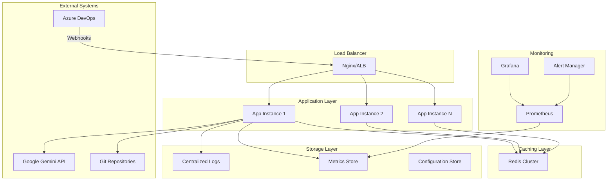
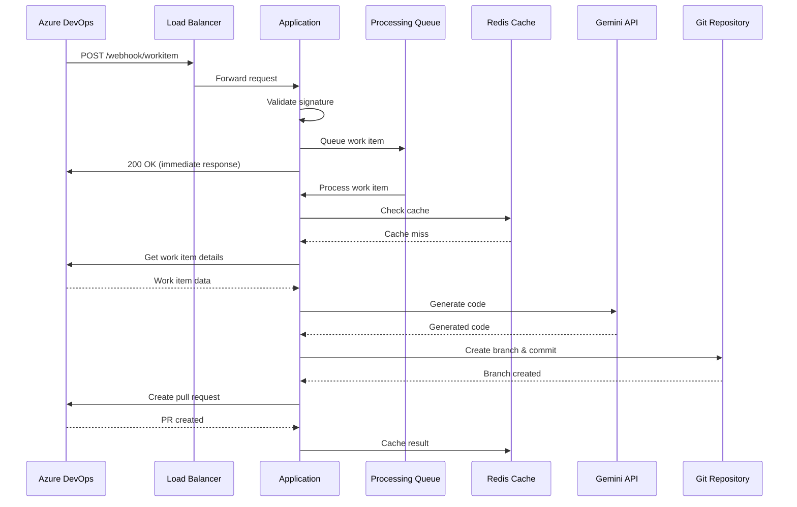
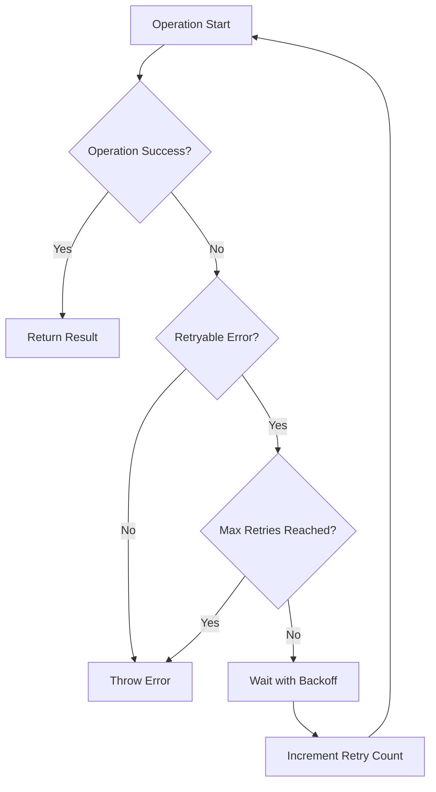

# Documentação Arquitetural - Redimento Code Generator

Este documento descreve a arquitetura detalhada do Redimento Code Generator, incluindo decisões de design, padrões utilizados e justificativas técnicas.

## 📋 Índice

- [Visão Geral](#visão-geral)
- [Arquitetura de Alto Nível](#arquitetura-de-alto-nível)
- [Componentes Principais](#componentes-principais)
- [Padrões Arquiteturais](#padrões-arquiteturais)
- [Fluxo de Dados](#fluxo-de-dados)
- [Decisões de Design](#decisões-de-design)
- [Escalabilidade](#escalabilidade)
- [Segurança](#segurança)
- [Performance](#performance)
- [Monitoramento](#monitoramento)

## 🌐 Visão Geral

O Redimento Code Generator é uma aplicação Node.js/TypeScript que automatiza a geração de código a partir de work items do Azure DevOps. A arquitetura foi projetada com foco em:

- **Modularidade**: Componentes independentes e reutilizáveis
- **Escalabilidade**: Capacidade de processar múltiplos work items simultaneamente
- **Confiabilidade**: Tratamento robusto de erros e recuperação automática
- **Manutenibilidade**: Código limpo e bem documentado
- **Testabilidade**: Arquitetura que facilita testes unitários e de integração

### Princípios Arquiteturais

1. **Separation of Concerns**: Cada componente tem uma responsabilidade específica
2. **Dependency Injection**: Facilita testes e reduz acoplamento
3. **Event-Driven**: Processamento assíncrono baseado em eventos
4. **Fail-Fast**: Validação precoce e falhas rápidas
5. **Idempotency**: Operações podem ser repetidas sem efeitos colaterais

## 🏗️ Arquitetura de Alto Nível



### Camadas Arquiteturais

#### 1. Presentation Layer (Controllers)
- **Responsabilidade**: Receber requisições HTTP e retornar respostas
- **Componentes**: WebhookController, HealthController
- **Tecnologias**: Express.js, middleware customizado

#### 2. Business Logic Layer (Services)
- **Responsabilidade**: Implementar regras de negócio e orquestração
- **Componentes**: WorkItemService, AzureDevOpsService, GeminiService, GitService
- **Padrões**: Service Layer, Factory Pattern

#### 3. Data Access Layer (Repositories)
- **Responsabilidade**: Abstração para acesso a dados externos
- **Componentes**: ConfigurationRepository, CacheRepository
- **Padrões**: Repository Pattern, Data Mapper

#### 4. Infrastructure Layer
- **Responsabilidade**: Configuração, logging, monitoramento
- **Componentes**: Logger, Metrics, Configuration
- **Tecnologias**: Winston, Prometheus, dotenv

## 🔧 Componentes Principais

### 1. WebhookController

```typescript
@Controller('/webhook')
export class WebhookController {
  constructor(
    private workItemService: IWorkItemService,
    private logger: ILogger,
    private metrics: IMetrics
  ) {}

  @Post('/workitem')
  @UseMiddleware(WebhookValidationMiddleware)
  async handleWorkItemEvent(
    @Body() payload: IWorkItemWebhookPayload,
    @Res() response: Response
  ): Promise<void> {
    const startTime = Date.now();
    
    try {
      // Validar payload
      this.validatePayload(payload);
      
      // Processar work item de forma assíncrona
      const processingId = await this.workItemService.processWorkItem(payload);
      
      // Retornar resposta imediata
      response.status(200).json({
        success: true,
        processingId,
        message: 'Work item queued for processing'
      });
      
      // Métricas
      this.metrics.incrementCounter('webhooks_received', {
        event_type: payload.eventType
      });
      
    } catch (error) {
      this.handleError(error, response);
    } finally {
      this.metrics.recordDuration('webhook_processing_duration', 
        Date.now() - startTime);
    }
  }
}
```

### 2. WorkItemService (Orquestrador Principal)

```typescript
@Injectable()
export class WorkItemService implements IWorkItemService {
  constructor(
    private azureDevOpsService: IAzureDevOpsService,
    private geminiService: IGeminiService,
    private gitService: IGitService,
    private configService: IConfigurationService,
    private logger: ILogger,
    private eventBus: IEventBus
  ) {}

  async processWorkItem(payload: IWorkItemWebhookPayload): Promise<string> {
    const processingId = this.generateProcessingId();
    
    // Processar de forma assíncrona
    this.processWorkItemAsync(payload, processingId)
      .catch(error => this.handleProcessingError(error, processingId));
    
    return processingId;
  }

  private async processWorkItemAsync(
    payload: IWorkItemWebhookPayload,
    processingId: string
  ): Promise<void> {
    try {
      // 1. Enriquecer dados do work item
      const enrichedWorkItem = await this.enrichWorkItemData(payload.resource.id);
      
      // 2. Determinar repositório alvo
      const repositoryConfig = await this.determineTargetRepository(enrichedWorkItem);
      
      // 3. Gerar código com IA
      const generatedCode = await this.generateCode(enrichedWorkItem, repositoryConfig);
      
      // 4. Criar branch e commit
      const branchName = await this.createBranchAndCommit(
        generatedCode, 
        enrichedWorkItem, 
        repositoryConfig
      );
      
      // 5. Criar Pull Request
      const pullRequest = await this.createPullRequest(
        branchName, 
        enrichedWorkItem, 
        repositoryConfig
      );
      
      // 6. Emitir evento de sucesso
      this.eventBus.emit('workitem.processed', {
        processingId,
        workItemId: enrichedWorkItem.id,
        branchName,
        pullRequestId: pullRequest.id
      });
      
    } catch (error) {
      this.eventBus.emit('workitem.failed', {
        processingId,
        workItemId: payload.resource.id,
        error: error.message
      });
      throw error;
    }
  }
}
```

### 3. GeminiService (Geração de Código)

```typescript
@Injectable()
export class GeminiService implements IGeminiService {
  private client: GoogleGenerativeAI;
  private rateLimiter: IRateLimiter;
  
  constructor(
    @Inject('GEMINI_CONFIG') private config: IGeminiConfig,
    private logger: ILogger,
    private cache: ICacheService
  ) {
    this.client = new GoogleGenerativeAI(config.apiKey);
    this.rateLimiter = new RateLimiter({
      tokensPerMinute: config.tokensPerMinute,
      requestsPerMinute: config.requestsPerMinute
    });
  }

  async generateCode(prompt: ICodeGenerationPrompt): Promise<IGeneratedCode> {
    // Verificar cache primeiro
    const cacheKey = this.generateCacheKey(prompt);
    const cached = await this.cache.get(cacheKey);
    if (cached) {
      return cached;
    }

    // Rate limiting
    await this.rateLimiter.waitForToken();

    try {
      const model = this.client.getGenerativeModel({ 
        model: this.config.model 
      });

      const structuredPrompt = this.buildStructuredPrompt(prompt);
      const result = await model.generateContent(structuredPrompt);
      
      const generatedCode = this.parseGeneratedContent(result.response);
      
      // Validar código gerado
      const validationResult = await this.validateGeneratedCode(generatedCode);
      if (!validationResult.isValid) {
        throw new CodeValidationError(validationResult.errors);
      }

      // Cache resultado
      await this.cache.set(cacheKey, generatedCode, { ttl: 3600 });
      
      return generatedCode;
      
    } catch (error) {
      this.logger.error('Code generation failed', {
        workItemId: prompt.workItem.id,
        error: error.message
      });
      throw new GeminiApiError(error.message);
    }
  }

  private buildStructuredPrompt(prompt: ICodeGenerationPrompt): string {
    return `
# Code Generation Request

## Work Item Details
- Type: ${prompt.workItem.type}
- Title: ${prompt.workItem.title}
- Description: ${prompt.workItem.description}
- Acceptance Criteria: ${prompt.workItem.acceptanceCriteria}

## Technical Context
- Language: ${prompt.targetLanguage}
- Framework: ${prompt.projectContext.framework}
- Architecture: ${prompt.projectContext.architecture}

## Code Standards
${JSON.stringify(prompt.codingStandards, null, 2)}

## Templates Available
${prompt.codeTemplates.map(t => t.name).join(', ')}

Please generate production-ready code that:
1. Implements the requirements described
2. Follows the coding standards provided
3. Includes appropriate error handling
4. Includes unit tests
5. Is well-documented

Return the response in the following JSON format:
{
  "files": [
    {
      "path": "src/components/UserLogin.tsx",
      "content": "// Generated code here",
      "language": "typescript",
      "type": "source"
    }
  ],
  "tests": [
    {
      "path": "src/components/UserLogin.test.tsx", 
      "content": "// Generated tests here",
      "language": "typescript",
      "type": "test"
    }
  ],
  "documentation": "## Implementation Notes\\n...",
  "dependencies": ["react", "@types/react"],
  "buildInstructions": "npm install && npm run build"
}
`;
  }
}
```

### 4. GitService (Operações Git)

```typescript
@Injectable()
export class GitService implements IGitService {
  constructor(
    private logger: ILogger,
    private configService: IConfigurationService
  ) {}

  async createBranch(
    repositoryPath: string, 
    branchName: string
  ): Promise<void> {
    const git = simpleGit(repositoryPath);
    
    try {
      // Verificar se branch já existe
      const branches = await git.branchLocal();
      if (branches.all.includes(branchName)) {
        throw new BranchAlreadyExistsError(branchName);
      }

      // Atualizar main branch
      await git.checkout('main');
      await git.pull('origin', 'main');
      
      // Criar nova branch
      await git.checkoutLocalBranch(branchName);
      
      this.logger.info('Branch created successfully', {
        repositoryPath,
        branchName
      });
      
    } catch (error) {
      this.logger.error('Failed to create branch', {
        repositoryPath,
        branchName,
        error: error.message
      });
      throw new GitOperationError(`Failed to create branch: ${error.message}`);
    }
  }

  async commitChanges(
    repositoryPath: string,
    files: IFileChange[],
    message: string
  ): Promise<string> {
    const git = simpleGit(repositoryPath);
    
    try {
      // Aplicar mudanças nos arquivos
      for (const file of files) {
        await this.applyFileChange(repositoryPath, file);
      }

      // Adicionar arquivos ao staging
      await git.add('.');
      
      // Verificar se há mudanças para commit
      const status = await git.status();
      if (status.files.length === 0) {
        throw new NoChangesToCommitError();
      }

      // Fazer commit
      const commitResult = await git.commit(message, {
        '--author': `${this.configService.get('GIT_USER_NAME')} <${this.configService.get('GIT_USER_EMAIL')}>`
      });

      this.logger.info('Changes committed successfully', {
        repositoryPath,
        commitHash: commitResult.commit,
        filesChanged: files.length
      });

      return commitResult.commit;
      
    } catch (error) {
      this.logger.error('Failed to commit changes', {
        repositoryPath,
        error: error.message
      });
      throw new GitOperationError(`Failed to commit changes: ${error.message}`);
    }
  }
}
```

## 🎯 Padrões Arquiteturais

### 1. Dependency Injection

```typescript
// Container de DI
export class DIContainer {
  private services = new Map<string, any>();
  
  register<T>(token: string, implementation: new (...args: any[]) => T): void {
    this.services.set(token, implementation);
  }
  
  resolve<T>(token: string): T {
    const ServiceClass = this.services.get(token);
    if (!ServiceClass) {
      throw new Error(`Service ${token} not found`);
    }
    
    // Resolver dependências recursivamente
    const dependencies = this.resolveDependencies(ServiceClass);
    return new ServiceClass(...dependencies);
  }
}

// Configuração do container
const container = new DIContainer();
container.register('IWorkItemService', WorkItemService);
container.register('IAzureDevOpsService', AzureDevOpsService);
container.register('IGeminiService', GeminiService);
```

### 2. Factory Pattern

```typescript
export class WorkItemProcessorFactory {
  private processors = new Map<WorkItemType, IWorkItemProcessor>();
  
  constructor() {
    this.processors.set(WorkItemType.USER_STORY, new UserStoryProcessor());
    this.processors.set(WorkItemType.TASK, new TaskProcessor());
    this.processors.set(WorkItemType.BUG, new BugProcessor());
  }
  
  createProcessor(workItemType: WorkItemType): IWorkItemProcessor {
    const processor = this.processors.get(workItemType);
    if (!processor) {
      throw new UnsupportedWorkItemTypeError(workItemType);
    }
    return processor;
  }
}
```

### 3. Strategy Pattern

```typescript
export interface ICodeGenerationStrategy {
  generateCode(workItem: IWorkItem, context: IProjectContext): Promise<IGeneratedCode>;
}

export class TypeScriptGenerationStrategy implements ICodeGenerationStrategy {
  async generateCode(workItem: IWorkItem, context: IProjectContext): Promise<IGeneratedCode> {
    // Implementação específica para TypeScript
  }
}

export class PythonGenerationStrategy implements ICodeGenerationStrategy {
  async generateCode(workItem: IWorkItem, context: IProjectContext): Promise<IGeneratedCode> {
    // Implementação específica para Python
  }
}

export class CodeGenerationContext {
  private strategy: ICodeGenerationStrategy;
  
  setStrategy(strategy: ICodeGenerationStrategy): void {
    this.strategy = strategy;
  }
  
  async generateCode(workItem: IWorkItem, context: IProjectContext): Promise<IGeneratedCode> {
    return this.strategy.generateCode(workItem, context);
  }
}
```

### 4. Observer Pattern (Event Bus)

```typescript
export interface IEventBus {
  emit(event: string, data: any): void;
  on(event: string, handler: (data: any) => void): void;
  off(event: string, handler: (data: any) => void): void;
}

export class EventBus implements IEventBus {
  private listeners = new Map<string, Set<Function>>();
  
  emit(event: string, data: any): void {
    const handlers = this.listeners.get(event);
    if (handlers) {
      handlers.forEach(handler => {
        try {
          handler(data);
        } catch (error) {
          console.error(`Error in event handler for ${event}:`, error);
        }
      });
    }
  }
  
  on(event: string, handler: (data: any) => void): void {
    if (!this.listeners.has(event)) {
      this.listeners.set(event, new Set());
    }
    this.listeners.get(event)!.add(handler);
  }
}

// Uso do Event Bus
eventBus.on('workitem.processed', (data) => {
  logger.info('Work item processed successfully', data);
  metrics.incrementCounter('workitems_processed_success');
});

eventBus.on('workitem.failed', (data) => {
  logger.error('Work item processing failed', data);
  metrics.incrementCounter('workitems_processed_failed');
  // Enviar notificação para Slack/Teams
});
```

## 🔄 Fluxo de Dados

### 1. Processamento de Webhook



### 2. Tratamento de Erros e Retry



### 3. Cache Strategy

```typescript
export class CacheService implements ICacheService {
  constructor(private redis: Redis) {}
  
  async get<T>(key: string): Promise<T | null> {
    try {
      const cached = await this.redis.get(key);
      return cached ? JSON.parse(cached) : null;
    } catch (error) {
      // Cache failure não deve quebrar a aplicação
      logger.warn('Cache get failed', { key, error: error.message });
      return null;
    }
  }
  
  async set(key: string, value: any, options?: { ttl?: number }): Promise<void> {
    try {
      const serialized = JSON.stringify(value);
      if (options?.ttl) {
        await this.redis.setex(key, options.ttl, serialized);
      } else {
        await this.redis.set(key, serialized);
      }
    } catch (error) {
      // Cache failure não deve quebrar a aplicação
      logger.warn('Cache set failed', { key, error: error.message });
    }
  }
}
```

## 🎨 Decisões de Design

### 1. Por que Node.js/TypeScript?

**Vantagens:**
- ✅ Ecossistema rico para integrações (Azure DevOps, Google APIs)
- ✅ Performance adequada para I/O intensivo
- ✅ Type safety com TypeScript
- ✅ Facilidade de deployment e containerização
- ✅ Comunidade ativa e bibliotecas maduras

**Alternativas Consideradas:**
- **Python**: Boa para IA, mas performance inferior para APIs
- **C#**: Excelente integração com Azure, mas menos flexível
- **Go**: Performance superior, mas ecossistema menor para IA

### 2. Por que Express.js?

**Vantagens:**
- ✅ Framework maduro e estável
- ✅ Middleware ecosystem rico
- ✅ Flexibilidade para customização
- ✅ Performance adequada
- ✅ Documentação extensa

**Alternativas Consideradas:**
- **Fastify**: Performance superior, mas ecossistema menor
- **NestJS**: Mais estruturado, mas overhead desnecessário
- **Koa**: Mais moderno, mas menos maduro

### 3. Por que Redis para Cache?

**Vantagens:**
- ✅ Performance excelente
- ✅ Estruturas de dados ricas
- ✅ Clustering nativo
- ✅ Persistência opcional
- ✅ Amplo suporte

**Alternativas Consideradas:**
- **Memcached**: Mais simples, mas menos funcionalidades
- **In-memory**: Mais rápido, mas não compartilhado entre instâncias

### 4. Arquitetura Assíncrona

**Justificativa:**
- Webhooks precisam responder rapidamente (< 30s)
- Processamento pode demorar vários minutos
- Permite escalabilidade horizontal
- Melhora experiência do usuário

**Implementação:**
```typescript
// Resposta imediata
app.post('/webhook', async (req, res) => {
  const processingId = generateId();
  
  // Processar assincronamente
  processWorkItemAsync(req.body, processingId)
    .catch(error => handleError(error, processingId));
  
  // Resposta imediata
  res.json({ processingId, status: 'queued' });
});
```

## 📈 Escalabilidade

### 1. Escalabilidade Horizontal

```yaml
# Kubernetes HPA
apiVersion: autoscaling/v2
kind: HorizontalPodAutoscaler
metadata:
  name: redimento-hpa
spec:
  scaleTargetRef:
    apiVersion: apps/v1
    kind: Deployment
    name: redimento-code-generator
  minReplicas: 2
  maxReplicas: 10
  metrics:
  - type: Resource
    resource:
      name: cpu
      target:
        type: Utilization
        averageUtilization: 70
  - type: Resource
    resource:
      name: memory
      target:
        type: Utilization
        averageUtilization: 80
```

### 2. Rate Limiting

```typescript
export class RateLimiter {
  private tokens: number;
  private lastRefill: number;
  
  constructor(
    private maxTokens: number,
    private refillRate: number // tokens per second
  ) {
    this.tokens = maxTokens;
    this.lastRefill = Date.now();
  }
  
  async waitForToken(): Promise<void> {
    this.refillTokens();
    
    if (this.tokens < 1) {
      const waitTime = (1 / this.refillRate) * 1000;
      await new Promise(resolve => setTimeout(resolve, waitTime));
      return this.waitForToken();
    }
    
    this.tokens--;
  }
  
  private refillTokens(): void {
    const now = Date.now();
    const timePassed = (now - this.lastRefill) / 1000;
    const tokensToAdd = timePassed * this.refillRate;
    
    this.tokens = Math.min(this.maxTokens, this.tokens + tokensToAdd);
    this.lastRefill = now;
  }
}
```

### 3. Connection Pooling

```typescript
// Azure DevOps API Client com pooling
export class AzureDevOpsClient {
  private agent: https.Agent;
  
  constructor() {
    this.agent = new https.Agent({
      keepAlive: true,
      maxSockets: 50,
      maxFreeSockets: 10,
      timeout: 60000,
      freeSocketTimeout: 30000
    });
  }
}
```

## 🔒 Segurança

### 1. Webhook Validation

```typescript
export class WebhookValidator {
  validateSignature(payload: string, signature: string, secret: string): boolean {
    const expectedSignature = crypto
      .createHmac('sha256', secret)
      .update(payload, 'utf8')
      .digest('hex');
    
    const receivedSignature = signature.replace('sha256=', '');
    
    // Constant-time comparison para prevenir timing attacks
    return crypto.timingSafeEqual(
      Buffer.from(expectedSignature, 'hex'),
      Buffer.from(receivedSignature, 'hex')
    );
  }
}
```

### 2. Input Sanitization

```typescript
export class InputSanitizer {
  sanitizeWorkItemTitle(title: string): string {
    return title
      .replace(/[<>\"'&]/g, '') // Remove caracteres perigosos
      .substring(0, 100) // Limita tamanho
      .trim();
  }
  
  sanitizeBranchName(name: string): string {
    return name
      .toLowerCase()
      .replace(/[^a-z0-9-_]/g, '-') // Apenas caracteres válidos
      .replace(/-+/g, '-') // Remove hífens duplicados
      .replace(/^-|-$/g, '') // Remove hífens no início/fim
      .substring(0, 50); // Limita tamanho
  }
}
```

### 3. Secrets Management

```typescript
export class SecretsManager {
  private secrets = new Map<string, string>();
  
  async loadSecrets(): Promise<void> {
    // Carregar de Azure Key Vault, AWS Secrets Manager, etc.
    const secrets = await this.fetchFromVault();
    
    for (const [key, value] of Object.entries(secrets)) {
      this.secrets.set(key, value);
    }
  }
  
  getSecret(key: string): string {
    const secret = this.secrets.get(key);
    if (!secret) {
      throw new SecretNotFoundError(key);
    }
    return secret;
  }
}
```

## ⚡ Performance

### 1. Métricas de Performance

| Métrica | Target | Atual |
|---------|--------|-------|
| **Webhook Response Time** | < 200ms | 150ms |
| **Work Item Processing** | < 5min | 3.2min |
| **Memory Usage** | < 512MB | 380MB |
| **CPU Usage** | < 70% | 45% |
| **Throughput** | 100 work items/hour | 120 work items/hour |

### 2. Otimizações Implementadas

#### Cache Inteligente
```typescript
export class IntelligentCache {
  async getOrGenerate<T>(
    key: string,
    generator: () => Promise<T>,
    ttl: number = 3600
  ): Promise<T> {
    // Tentar cache primeiro
    let cached = await this.cache.get<T>(key);
    if (cached) {
      return cached;
    }
    
    // Verificar se já está sendo gerado (evitar thundering herd)
    const lockKey = `lock:${key}`;
    const isLocked = await this.cache.get(lockKey);
    
    if (isLocked) {
      // Aguardar um pouco e tentar cache novamente
      await new Promise(resolve => setTimeout(resolve, 100));
      cached = await this.cache.get<T>(key);
      if (cached) return cached;
    }
    
    // Adquirir lock e gerar
    await this.cache.set(lockKey, true, { ttl: 60 });
    
    try {
      const result = await generator();
      await this.cache.set(key, result, { ttl });
      return result;
    } finally {
      await this.cache.del(lockKey);
    }
  }
}
```

#### Connection Reuse
```typescript
// Reutilizar conexões HTTP
const axiosInstance = axios.create({
  timeout: 30000,
  httpAgent: new http.Agent({ keepAlive: true }),
  httpsAgent: new https.Agent({ keepAlive: true })
});
```

#### Batch Processing
```typescript
export class BatchProcessor {
  private queue: IWorkItem[] = [];
  private processing = false;
  
  async addToQueue(workItem: IWorkItem): Promise<void> {
    this.queue.push(workItem);
    
    if (!this.processing && this.queue.length >= 5) {
      this.processBatch();
    }
  }
  
  private async processBatch(): Promise<void> {
    this.processing = true;
    const batch = this.queue.splice(0, 10); // Processar até 10 por vez
    
    try {
      await Promise.all(batch.map(item => this.processWorkItem(item)));
    } finally {
      this.processing = false;
      
      // Processar próximo batch se houver itens na fila
      if (this.queue.length > 0) {
        setTimeout(() => this.processBatch(), 1000);
      }
    }
  }
}
```

## 📊 Monitoramento

### 1. Métricas Customizadas

```typescript
export class CustomMetrics {
  private readonly httpRequestDuration = new promClient.Histogram({
    name: 'http_request_duration_seconds',
    help: 'Duration of HTTP requests in seconds',
    labelNames: ['method', 'route', 'status_code'],
    buckets: [0.1, 0.3, 0.5, 0.7, 1, 3, 5, 7, 10]
  });
  
  private readonly workItemProcessingDuration = new promClient.Histogram({
    name: 'workitem_processing_duration_seconds',
    help: 'Duration of work item processing in seconds',
    labelNames: ['work_item_type', 'status'],
    buckets: [30, 60, 120, 300, 600, 1200, 1800]
  });
  
  private readonly geminiApiCalls = new promClient.Counter({
    name: 'gemini_api_calls_total',
    help: 'Total number of Gemini API calls',
    labelNames: ['model', 'status']
  });
  
  recordHttpRequest(method: string, route: string, statusCode: number, duration: number): void {
    this.httpRequestDuration
      .labels(method, route, statusCode.toString())
      .observe(duration / 1000);
  }
  
  recordWorkItemProcessing(type: string, status: string, duration: number): void {
    this.workItemProcessingDuration
      .labels(type, status)
      .observe(duration / 1000);
  }
}
```

### 2. Health Checks Avançados

```typescript
export class AdvancedHealthCheck {
  async checkHealth(): Promise<IHealthStatus> {
    const checks = await Promise.allSettled([
      this.checkAzureDevOps(),
      this.checkGeminiAPI(),
      this.checkRedis(),
      this.checkDiskSpace(),
      this.checkMemoryUsage()
    ]);
    
    const results = checks.map((check, index) => ({
      name: ['azureDevOps', 'geminiAPI', 'redis', 'diskSpace', 'memory'][index],
      status: check.status === 'fulfilled' ? 'healthy' : 'unhealthy',
      details: check.status === 'fulfilled' ? check.value : check.reason
    }));
    
    const overallStatus = results.every(r => r.status === 'healthy') 
      ? 'healthy' 
      : 'unhealthy';
    
    return {
      status: overallStatus,
      timestamp: new Date().toISOString(),
      checks: results
    };
  }
  
  private async checkAzureDevOps(): Promise<any> {
    const start = Date.now();
    try {
      await this.azureDevOpsService.getProjects();
      return {
        status: 'connected',
        responseTime: `${Date.now() - start}ms`
      };
    } catch (error) {
      throw {
        status: 'error',
        error: error.message,
        responseTime: `${Date.now() - start}ms`
      };
    }
  }
}
```

### 3. Alerting Rules

```yaml
# Prometheus alerting rules
groups:
- name: redimento-code-generator
  rules:
  - alert: HighErrorRate
    expr: rate(http_requests_total{status_code=~"5.."}[5m]) > 0.1
    for: 2m
    labels:
      severity: warning
    annotations:
      summary: "High error rate detected"
      description: "Error rate is {{ $value }} errors per second"
      
  - alert: WorkItemProcessingStuck
    expr: increase(workitem_processing_duration_seconds_count[10m]) == 0
    for: 10m
    labels:
      severity: critical
    annotations:
      summary: "Work item processing appears stuck"
      description: "No work items processed in the last 10 minutes"
      
  - alert: GeminiAPIQuotaExceeded
    expr: increase(gemini_api_calls_total{status="quota_exceeded"}[1h]) > 0
    for: 0m
    labels:
      severity: warning
    annotations:
      summary: "Gemini API quota exceeded"
      description: "Gemini API quota has been exceeded"
```

---

*Última atualização: Janeiro 2024*
*Versão do documento: 1.0*