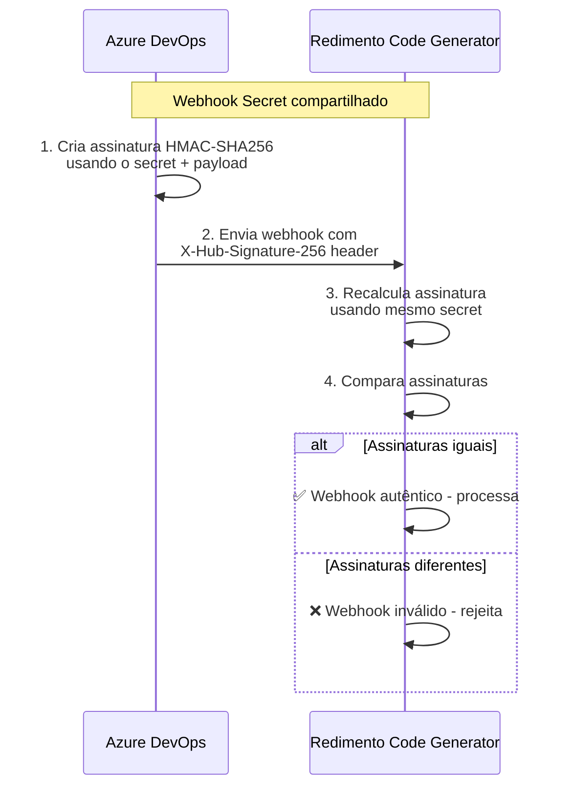

# Configuração do Azure DevOps

Este documento explica como configurar as credenciais e webhooks necessários para integrar o Redimento Code Generator com o Azure DevOps.

## Índice

- [Personal Access Token (PAT)](#personal-access-token-pat)
- [Webhook Secret](#webhook-secret)
- [Configuração de Service Hooks](#configuração-de-service-hooks)
- [Variáveis de Ambiente](#variáveis-de-ambiente)
- [Validação da Configuração](#validação-da-configuração)
- [Troubleshooting](#troubleshooting)

## Personal Access Token (PAT)

### O que é

O **AZURE_DEVOPS_TOKEN** é um Personal Access Token (PAT) que permite ao sistema autenticar e interagir com a API REST do Azure DevOps sem usar credenciais de usuário.

### Para que serve

O sistema usa este token para:

- ✅ **Buscar detalhes de work items** - Obter informações completas dos work items
- ✅ **Adicionar comentários** - Comentar nos work items quando precisar de mais informações  
- ✅ **Vincular Pull Requests** - Conectar PRs criados aos work items originais
- ✅ **Acessar metadados do projeto** - Obter configurações e estrutura do projeto

### Como obter

1. **Acesse o Azure DevOps** da sua organização
   ```
   https://dev.azure.com/sua-organizacao
   ```

2. **Clique no seu avatar** (canto superior direito)

3. **Selecione "Personal access tokens"**

4. **Clique em "New Token"**

5. **Configure o token:**
   - **Name**: `Redimento Code Generator`
   - **Organization**: Selecione sua organização
   - **Expiration**: Recomendado 90 dias (renove periodicamente)
   - **Scopes**: Custom defined

6. **Selecione as permissões necessárias:**
   ```
   ✅ Work Items: Read & Write
   ✅ Code: Read & Write  
   ✅ Project and Team: Read
   ✅ Pull Request: Read & Write
   ✅ Build: Read (opcional, para futuras integrações)
   ```

7. **Clique em "Create"**

8. **Copie o token** (será exibido apenas uma vez)

### Exemplo de configuração

```bash
# No arquivo .env
AZURE_DEVOPS_ORG_URL=https://dev.azure.com/minha-empresa
AZURE_DEVOPS_TOKEN=aaaaaaaaaaaaaaaaaaaaaaaaaaaaaaaaaaaaaaaaaaaaaaaaaaaaaa
AZURE_DEVOPS_PROJECT=meu-projeto-principal
```

## Webhook Secret

### O que é

O **WEBHOOK_SECRET** é uma chave secreta que você define para validar que os webhooks recebidos realmente vêm do Azure DevOps e não de fontes maliciosas.

### Como funciona a segurança



### Como gerar um secret seguro

Escolha uma das opções para gerar uma string aleatória segura:

#### Opção 1: Node.js
```bash
node -e "console.log(require('crypto').randomBytes(32).toString('hex'))"
```

#### Opção 2: OpenSSL
```bash
openssl rand -hex 32
```

#### Opção 3: PowerShell (Windows)
```powershell
[System.Web.Security.Membership]::GeneratePassword(64, 10)
```

#### Opção 4: Online (use sites confiáveis)
- https://www.random.org/strings/
- Configure: 1 string, 64 caracteres, alfanumérico

### Exemplo de secret gerado
```bash
WEBHOOK_SECRET=f4e5d6c7b8a9102938475665748392019283746556473829abc123def456ghi789
```

## Configuração de Service Hooks

### Passo a passo

1. **Acesse seu projeto** no Azure DevOps
   ```
   https://dev.azure.com/sua-organizacao/seu-projeto
   ```

2. **Navegue para configurações**
   - Clique em **Project Settings** (canto inferior esquerdo)
   - No menu lateral, clique em **Service hooks**

3. **Crie uma nova subscription**
   - Clique em **"Create subscription"**
   - Selecione **"Web Hooks"**
   - Clique em **"Next"**

4. **Configure o evento trigger**
   ```
   Service: Work item tracking
   Event type: Work item updated
   
   Filters (opcional):
   ✅ Area path: [deixe vazio para todos]
   ✅ Work item type: [deixe vazio para todos os tipos]
   ✅ State: [deixe vazio para todos os estados]
   ```

5. **Configure a ação**
   ```
   URL: https://seu-servidor.com/webhook/workitem
   HTTP headers: [deixe vazio]
   Basic authentication: [deixe vazio]
   Resource details to send: All
   Messages to send: All
   Detailed messages to send: All
   
   ⚠️ IMPORTANTE:
   Secret: f4e5d6c7b8a9102938475665748392019283746556473829abc123def456ghi789
   ```

6. **Teste a configuração**
   - Clique em **"Test"** para enviar um webhook de teste
   - Verifique se seu servidor recebe e valida corretamente

7. **Finalize**
   - Clique em **"Finish"**
   - O webhook estará ativo e enviará notificações

### Eventos recomendados

Configure webhooks para os seguintes eventos:

| Evento | Descrição | Necessário |
|--------|-----------|------------|
| **Work item created** | Quando um novo work item é criado | ✅ Sim |
| **Work item updated** | Quando um work item é modificado | ✅ Sim |
| **Work item deleted** | Quando um work item é excluído | ⚠️ Opcional |

## Variáveis de Ambiente

### Arquivo .env completo

Crie um arquivo `.env` na raiz do projeto com todas as configurações:

```bash
# ===========================================
# CONFIGURAÇÃO DO SERVIDOR
# ===========================================
PORT=3000
NODE_ENV=production

# ===========================================
# CONFIGURAÇÃO DO AZURE DEVOPS
# ===========================================
# URL da sua organização (sem barra no final)
AZURE_DEVOPS_ORG_URL=https://dev.azure.com/sua-organizacao

# Personal Access Token (obtido no passo anterior)
AZURE_DEVOPS_TOKEN=aaaaaaaaaaaaaaaaaaaaaaaaaaaaaaaaaaaaaaaaaaaaaaaaaaaaaa

# Nome do projeto principal (pode ser alterado via configuração)
AZURE_DEVOPS_PROJECT=meu-projeto

# ===========================================
# CONFIGURAÇÃO DE WEBHOOK
# ===========================================
# Secret compartilhado com Azure DevOps (gerado no passo anterior)
WEBHOOK_SECRET=f4e5d6c7b8a9102938475665748392019283746556473829abc123def456ghi789

# ===========================================
# CONFIGURAÇÃO DO GOOGLE GEMINI
# ===========================================
# API Key do Google Cloud (obtenha em https://console.cloud.google.com)
GEMINI_API_KEY=sua-chave-da-api-gemini

# Modelo a ser usado (gemini-pro é recomendado)
GEMINI_MODEL=gemini-pro

# ===========================================
# CONFIGURAÇÃO GIT
# ===========================================
# Informações para commits automáticos
GIT_USER_NAME=Redimento Code Generator
GIT_USER_EMAIL=redimento@suaempresa.com
GIT_DEFAULT_BRANCH=main

# ===========================================
# CONFIGURAÇÃO DE REPOSITÓRIOS
# ===========================================
# Diretório base onde repositórios serão clonados
REPOS_BASE_PATH=./repos

# Revisores padrão para PRs (separados por vírgula)
DEFAULT_REVIEWERS=dev1@empresa.com,dev2@empresa.com,arquiteto@empresa.com

# ===========================================
# CONFIGURAÇÃO DE LOGGING
# ===========================================
LOG_LEVEL=info
LOG_FILE=./logs/app.log

# ===========================================
# CONFIGURAÇÃO DE RETRY E TIMEOUTS
# ===========================================
MAX_RETRY_ATTEMPTS=3
RETRY_BASE_DELAY=1000
RETRY_MAX_DELAY=10000
HEALTH_CHECK_TIMEOUT=5000

# ===========================================
# CONFIGURAÇÃO DE SEGURANÇA
# ===========================================
# Chave para endpoints internos de administração
API_KEY=sua-chave-api-interna-super-secreta
```

### Validação das variáveis

O sistema validará automaticamente se todas as variáveis obrigatórias estão configuradas:

```typescript
// Variáveis obrigatórias
const requiredVars = [
  'AZURE_DEVOPS_ORG_URL',
  'AZURE_DEVOPS_TOKEN', 
  'AZURE_DEVOPS_PROJECT',
  'WEBHOOK_SECRET',
  'GEMINI_API_KEY'
];
```

## Validação da Configuração

### Teste de conectividade

Após configurar, teste se tudo está funcionando:

1. **Inicie o sistema**
   ```bash
   npm start
   ```

2. **Verifique o health check**
   ```bash
   curl http://localhost:3000/health
   ```
   
   Resposta esperada:
   ```json
   {
     "status": "healthy",
     "timestamp": "2024-01-30T10:00:00.000Z",
     "services": {
       "azureDevOps": "connected",
       "gemini": "connected",
       "git": "ready"
     }
   }
   ```

3. **Teste o webhook**
   - Crie ou edite um work item no Azure DevOps
   - Verifique os logs do sistema para confirmar recebimento
   - Verifique se uma branch foi criada no repositório

### Logs de validação

O sistema registrará eventos importantes:

```
[INFO] Azure DevOps connection validated successfully
[INFO] Gemini API connection validated successfully  
[INFO] Webhook endpoint listening on /webhook/workitem
[INFO] Webhook received and validated for work item #1234
[INFO] Branch feat/1234_implement-user-login created successfully
```

## Troubleshooting

### Problemas comuns

#### 1. Token inválido ou expirado
```
Error: Azure DevOps API returned 401 Unauthorized
```

**Solução:**
- Verifique se o token não expirou
- Confirme se as permissões estão corretas
- Gere um novo token se necessário

#### 2. Webhook não recebido
```
Warning: No webhooks received in the last 10 minutes
```

**Solução:**
- Verifique se a URL do webhook está correta
- Confirme se o serviço está acessível externamente
- Teste a conectividade de rede

#### 3. Assinatura de webhook inválida
```
Error: Webhook signature validation failed
```

**Solução:**
- Verifique se o `WEBHOOK_SECRET` está correto
- Confirme se o mesmo secret foi usado no Azure DevOps
- Regenere o secret se necessário

#### 4. Permissões insuficientes
```
Error: Access denied when creating pull request
```

**Solução:**
- Verifique se o token tem permissões de "Code: Read & Write"
- Confirme se o usuário do token tem acesso ao repositório
- Verifique políticas de branch do repositório

### Comandos de diagnóstico

```bash
# Verificar conectividade com Azure DevOps
curl -H "Authorization: Basic $(echo -n :$AZURE_DEVOPS_TOKEN | base64)" \
  "$AZURE_DEVOPS_ORG_URL/$AZURE_DEVOPS_PROJECT/_apis/wit/workitems/1?api-version=6.0"

# Testar webhook localmente
curl -X POST http://localhost:3000/webhook/workitem \
  -H "Content-Type: application/json" \
  -H "X-Hub-Signature-256: sha256=test" \
  -d '{"eventType":"workitem.updated","resource":{"id":1234}}'

# Verificar logs em tempo real
tail -f ./logs/app.log
```

### Contato para suporte

Se os problemas persistirem:

1. **Verifique os logs** em `./logs/app.log`
2. **Colete informações** sobre o erro específico
3. **Documente os passos** que levaram ao problema
4. **Entre em contato** com a equipe de desenvolvimento

---

## Segurança e Boas Práticas

### ⚠️ Importantes considerações de segurança

1. **Nunca commite credenciais** no código fonte
2. **Use variáveis de ambiente** para todas as configurações sensíveis
3. **Renove tokens periodicamente** (recomendado: a cada 90 dias)
4. **Monitore logs** para tentativas de acesso não autorizadas
5. **Use HTTPS** em produção para todos os endpoints
6. **Restrinja acesso** aos endpoints administrativos

### 📋 Checklist de configuração

- [ ] Personal Access Token criado com permissões corretas
- [ ] Webhook Secret gerado e configurado
- [ ] Service Hook configurado no Azure DevOps
- [ ] Arquivo .env criado com todas as variáveis
- [ ] Teste de conectividade realizado com sucesso
- [ ] Logs verificados para confirmar funcionamento
- [ ] Documentação de configuração salva em local seguro

---

*Última atualização: Janeiro 2024*
*Versão do documento: 1.0*