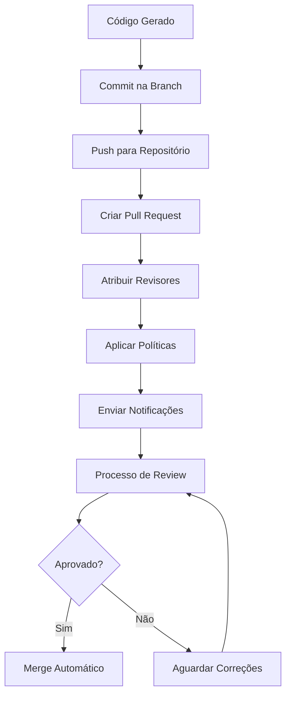
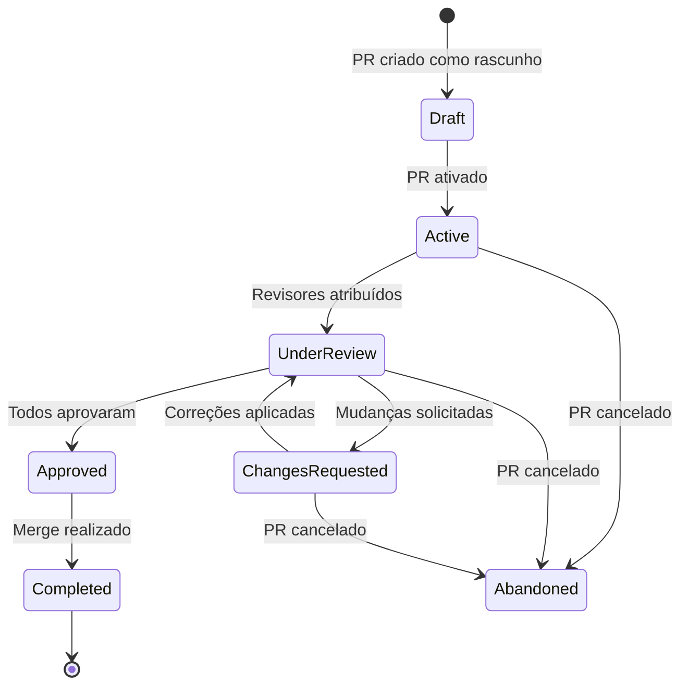

# Configuração de Pull Requests - Redimento Code Generator

Este documento explica como configurar a criação automática de Pull Requests, incluindo revisores, políticas e fluxo de aprovação.

## 📋 Índice

- [Visão Geral](#visão-geral)
- [DEFAULT_REVIEWERS](#default_reviewers)
- [Configuração de Pull Requests](#configuração-de-pull-requests)
- [Políticas de Branch](#políticas-de-branch)
- [Fluxo de Aprovação](#fluxo-de-aprovação)
- [Configurações Avançadas](#configurações-avançadas)
- [Monitoramento](#monitoramento)
- [Troubleshooting](#troubleshooting)

## 🌐 Visão Geral

O Redimento Code Generator cria Pull Requests automaticamente após gerar código para work items. O sistema pode atribuir revisores, configurar políticas e gerenciar o fluxo de aprovação de forma inteligente.

### Fluxo de Pull Request



### Benefícios da automação

- ✅ **Consistência**: PRs sempre criados com padrão uniforme
- ✅ **Eficiência**: Revisores atribuídos automaticamente
- ✅ **Rastreabilidade**: Vinculação automática com work items
- ✅ **Qualidade**: Políticas aplicadas automaticamente
- ✅ **Notificações**: Equipe informada em tempo real

## 👥 DEFAULT_REVIEWERS

### O que é

O **DEFAULT_REVIEWERS** é uma lista de emails dos desenvolvedores que devem ser automaticamente atribuídos como revisores em todos os Pull Requests criados pelo sistema.

```bash
# Configuração básica
DEFAULT_REVIEWERS=dev-lead@empresa.com,senior-dev@empresa.com,arquiteto@empresa.com
```

### Formato da configuração

```bash
# Lista de emails separados por vírgula (SEM ESPAÇOS)
DEFAULT_REVIEWERS=email1@empresa.com,email2@empresa.com,email3@empresa.com

# ❌ Incorreto - com espaços
DEFAULT_REVIEWERS=email1@empresa.com, email2@empresa.com, email3@empresa.com

# ✅ Correto - sem espaços
DEFAULT_REVIEWERS=email1@empresa.com,email2@empresa.com,email3@empresa.com
```

### Exemplos por cenário

#### Equipe pequena (2-5 pessoas)
```bash
DEFAULT_REVIEWERS=tech-lead@empresa.com,senior-dev@empresa.com
```

#### Equipe média (5-10 pessoas)
```bash
DEFAULT_REVIEWERS=tech-lead@empresa.com,senior-dev1@empresa.com,senior-dev2@empresa.com
```

#### Equipe grande (10+ pessoas)
```bash
DEFAULT_REVIEWERS=tech-lead@empresa.com,arquiteto@empresa.com,senior-dev@empresa.com,qa-lead@empresa.com
```

#### Por especialidade
```bash
# Frontend
DEFAULT_REVIEWERS=frontend-lead@empresa.com,react-expert@empresa.com,ui-designer@empresa.com

# Backend
DEFAULT_REVIEWERS=backend-lead@empresa.com,api-expert@empresa.com,dba@empresa.com

# DevOps
DEFAULT_REVIEWERS=devops-lead@empresa.com,infra-expert@empresa.com,security@empresa.com
```

### Boas práticas para revisores

#### 1. Número ideal
```bash
# ✅ Ideal: 2-4 revisores
DEFAULT_REVIEWERS=lead@empresa.com,senior@empresa.com,expert@empresa.com

# ❌ Evitar: Muitos revisores (processo lento)
DEFAULT_REVIEWERS=dev1@empresa.com,dev2@empresa.com,dev3@empresa.com,dev4@empresa.com,dev5@empresa.com,dev6@empresa.com

# ❌ Evitar: Apenas 1 revisor (risco de qualidade)
DEFAULT_REVIEWERS=lead@empresa.com
```

#### 2. Mix de experiência
```bash
# ✅ Bom: Diferentes níveis de experiência
DEFAULT_REVIEWERS=tech-lead@empresa.com,senior-dev@empresa.com,mid-dev@empresa.com

# ✅ Bom: Especialistas em diferentes áreas
DEFAULT_REVIEWERS=backend-expert@empresa.com,frontend-expert@empresa.com,security-expert@empresa.com
```

#### 3. Disponibilidade
```bash
# ✅ Bom: Pessoas ativas e disponíveis
DEFAULT_REVIEWERS=active-dev1@empresa.com,active-dev2@empresa.com

# ❌ Evitar: Pessoas em férias ou indisponíveis
DEFAULT_REVIEWERS=pessoa-ferias@empresa.com,pessoa-licenca@empresa.com
```

## 🔧 Configuração de Pull Requests

### Configurações básicas

```bash
# ===========================================
# CONFIGURAÇÃO DE PULL REQUESTS
# ===========================================

# Revisores padrão (obrigatório)
DEFAULT_REVIEWERS=tech-lead@empresa.com,senior-dev@empresa.com

# Configurações do PR
PR_AUTO_COMPLETE=false
PR_DELETE_SOURCE_BRANCH=true
PR_SQUASH_MERGE=true
PR_DRAFT_MODE=false

# Template de título e descrição
PR_TITLE_TEMPLATE="[AUTO] {workItemType}: {workItemTitle} (#{workItemId})"
PR_DESCRIPTION_TEMPLATE="Código gerado automaticamente para o work item #{workItemId}"
```

### Configurações avançadas

```bash
# ===========================================
# CONFIGURAÇÕES AVANÇADAS DE PR
# ===========================================

# Políticas de aprovação
PR_REQUIRED_REVIEWERS=2
PR_REQUIRE_ALL_REVIEWERS=false
PR_ALLOW_SELF_APPROVAL=false

# Políticas de build
PR_REQUIRE_BUILD_SUCCESS=true
PR_BUILD_DEFINITION_ID=123

# Políticas de work item
PR_REQUIRE_WORK_ITEM_LINK=true
PR_REQUIRE_WORK_ITEM_STATE=Active

# Configurações de merge
PR_MERGE_STRATEGY=squash
PR_AUTO_MERGE_ENABLED=false
PR_AUTO_MERGE_CONDITIONS="build_success,all_reviewers_approved"

# Labels automáticas
PR_AUTO_LABELS="auto-generated,code-review-required"
```

### Template de Pull Request

O sistema usa templates para criar PRs consistentes:

#### Template de título
```bash
PR_TITLE_TEMPLATE="[AUTO] {workItemType}: {workItemTitle} (#{workItemId})"
```

**Resultado:**
```
[AUTO] User Story: Implement user authentication (#1234)
```

#### Template de descrição
```markdown
# Pull Request Automático

## Work Item
- **ID**: #{workItemId}
- **Tipo**: {workItemType}
- **Título**: {workItemTitle}
- **URL**: {workItemUrl}

## Código Gerado
Este Pull Request contém código gerado automaticamente pelo Redimento Code Generator baseado nos requisitos do work item.

### Arquivos Modificados
{filesList}

### Testes Incluídos
{testsList}

## Critérios de Aceitação
{acceptanceCriteria}

## Checklist de Review
- [ ] Código segue padrões da equipe
- [ ] Testes estão incluídos e passando
- [ ] Documentação foi atualizada
- [ ] Não há vulnerabilidades de segurança
- [ ] Performance é adequada

## Observações
- Código gerado automaticamente em {timestamp}
- Baseado no work item: {workItemUrl}
- Revisores atribuídos automaticamente

---
*Gerado automaticamente pelo Redimento Code Generator*
```

## 📋 Políticas de Branch

### Configuração no Azure DevOps

O sistema pode configurar políticas de branch automaticamente:

```typescript
export interface IBranchPolicy {
  minimumApproverCount: number;
  creatorVoteCounts: boolean;
  allowDownvotes: boolean;
  resetOnSourcePush: boolean;
  requireBuildSuccess: boolean;
  buildDefinitionId?: number;
  requireWorkItemLink: boolean;
  requiredReviewerIds: string[];
}
```

### Políticas recomendadas

#### Para projetos críticos
```json
{
  "minimumApproverCount": 2,
  "creatorVoteCounts": false,
  "allowDownvotes": true,
  "resetOnSourcePush": true,
  "requireBuildSuccess": true,
  "requireWorkItemLink": true,
  "requiredReviewerIds": ["tech-lead@empresa.com"]
}
```

#### Para projetos internos
```json
{
  "minimumApproverCount": 1,
  "creatorVoteCounts": false,
  "allowDownvotes": true,
  "resetOnSourcePush": false,
  "requireBuildSuccess": true,
  "requireWorkItemLink": true
}
```

### Configuração via código

```typescript
export class BranchPolicyManager {
  async applyDefaultPolicies(repositoryId: string, branchName: string): Promise<void> {
    const policies: IBranchPolicy[] = [
      {
        type: 'minimumApproverCount',
        settings: {
          minimumApproverCount: this.config.requiredReviewers,
          creatorVoteCounts: false,
          allowDownvotes: true,
          resetOnSourcePush: this.config.resetOnPush
        }
      },
      {
        type: 'buildPolicy',
        settings: {
          buildDefinitionId: this.config.buildDefinitionId,
          queueOnSourceUpdateOnly: true,
          manualQueueOnly: false,
          displayName: 'Automated Build Validation'
        }
      },
      {
        type: 'workItemLinking',
        settings: {
          requiredState: 'Active'
        }
      }
    ];

    for (const policy of policies) {
      await this.azureDevOpsService.createBranchPolicy(repositoryId, branchName, policy);
    }
  }
}
```

## 🔄 Fluxo de Aprovação

### Estados do Pull Request



### Automação do fluxo

```typescript
export class PullRequestAutomation {
  async handlePullRequestEvent(event: IPullRequestEvent): Promise<void> {
    switch (event.eventType) {
      case 'pullrequest.created':
        await this.onPullRequestCreated(event);
        break;
        
      case 'pullrequest.updated':
        await this.onPullRequestUpdated(event);
        break;
        
      case 'pullrequest.approved':
        await this.onPullRequestApproved(event);
        break;
        
      case 'pullrequest.completed':
        await this.onPullRequestCompleted(event);
        break;
    }
  }
  
  private async onPullRequestCreated(event: IPullRequestEvent): Promise<void> {
    // Atribuir revisores
    await this.assignReviewers(event.pullRequestId);
    
    // Aplicar labels
    await this.applyLabels(event.pullRequestId);
    
    // Enviar notificações
    await this.sendNotifications(event.pullRequestId);
    
    // Iniciar build automático
    if (this.config.autoBuildEnabled) {
      await this.triggerBuild(event.pullRequestId);
    }
  }
  
  private async onPullRequestApproved(event: IPullRequestEvent): Promise<void> {
    const pr = await this.azureDevOpsService.getPullRequest(event.pullRequestId);
    
    // Verificar se todos os revisores aprovaram
    if (await this.allReviewersApproved(pr)) {
      // Verificar se build passou
      if (await this.buildSuccessful(pr)) {
        // Auto-merge se configurado
        if (this.config.autoMergeEnabled) {
          await this.mergePullRequest(event.pullRequestId);
        }
      }
    }
  }
}
```

## ⚙️ Configurações Avançadas

### Revisores dinâmicos

```typescript
export class DynamicReviewerAssignment {
  async assignReviewers(workItem: IWorkItem, pullRequestId: number): Promise<void> {
    let reviewers: string[] = [];
    
    // Revisores baseados na área do projeto
    const areaReviewers = await this.getReviewersByArea(workItem.areaPath);
    reviewers.push(...areaReviewers);
    
    // Revisores baseados no tipo de work item
    const typeReviewers = await this.getReviewersByType(workItem.type);
    reviewers.push(...typeReviewers);
    
    // Revisores baseados na complexidade
    const complexityReviewers = await this.getReviewersByComplexity(workItem);
    reviewers.push(...complexityReviewers);
    
    // Adicionar revisores padrão
    const defaultReviewers = this.config.defaultReviewers.split(',');
    reviewers.push(...defaultReviewers);
    
    // Remover duplicatas e limitar número
    reviewers = [...new Set(reviewers)].slice(0, this.config.maxReviewers);
    
    await this.azureDevOpsService.addReviewers(pullRequestId, reviewers);
  }
}
```

### Configuração por projeto

```json
{
  "projects": {
    "frontend-app": {
      "defaultReviewers": ["frontend-lead@empresa.com", "ui-expert@empresa.com"],
      "requiredReviewers": 2,
      "autoMerge": false,
      "buildRequired": true,
      "labels": ["frontend", "auto-generated"]
    },
    "backend-api": {
      "defaultReviewers": ["backend-lead@empresa.com", "api-expert@empresa.com", "dba@empresa.com"],
      "requiredReviewers": 3,
      "autoMerge": false,
      "buildRequired": true,
      "securityReview": true,
      "labels": ["backend", "api", "auto-generated"]
    },
    "shared-lib": {
      "defaultReviewers": ["tech-lead@empresa.com", "arquiteto@empresa.com"],
      "requiredReviewers": 2,
      "autoMerge": false,
      "buildRequired": true,
      "breakingChangeReview": true,
      "labels": ["library", "shared", "auto-generated"]
    }
  }
}
```

### Notificações customizadas

```typescript
export class NotificationManager {
  async sendPullRequestNotifications(pullRequest: IPullRequest): Promise<void> {
    // Notificação para revisores
    await this.sendReviewerNotification(pullRequest);
    
    // Notificação para autor do work item
    await this.sendWorkItemAuthorNotification(pullRequest);
    
    // Notificação para Slack/Teams
    if (this.config.slackEnabled) {
      await this.sendSlackNotification(pullRequest);
    }
    
    // Notificação para email
    if (this.config.emailEnabled) {
      await this.sendEmailNotification(pullRequest);
    }
  }
  
  private async sendSlackNotification(pullRequest: IPullRequest): Promise<void> {
    const message = {
      text: `🔄 Novo Pull Request criado automaticamente`,
      blocks: [
        {
          type: 'section',
          text: {
            type: 'mrkdwn',
            text: `*Pull Request:* <${pullRequest.url}|${pullRequest.title}>\n*Work Item:* <${pullRequest.workItemUrl}|#${pullRequest.workItemId}>\n*Revisores:* ${pullRequest.reviewers.join(', ')}`
          }
        },
        {
          type: 'actions',
          elements: [
            {
              type: 'button',
              text: { type: 'plain_text', text: 'Ver PR' },
              url: pullRequest.url,
              style: 'primary'
            },
            {
              type: 'button',
              text: { type: 'plain_text', text: 'Ver Work Item' },
              url: pullRequest.workItemUrl
            }
          ]
        }
      ]
    };
    
    await this.slackClient.postMessage(this.config.slackChannel, message);
  }
}
```

## 📊 Monitoramento

### Métricas de Pull Requests

```typescript
export class PullRequestMetrics {
  async collectMetrics(): Promise<IPullRequestMetrics> {
    return {
      totalPullRequests: await this.getTotalPullRequests(),
      averageReviewTime: await this.getAverageReviewTime(),
      approvalRate: await this.getApprovalRate(),
      mergeRate: await this.getMergeRate(),
      reviewerParticipation: await this.getReviewerParticipation(),
      pullRequestsByStatus: await this.getPullRequestsByStatus(),
      pullRequestsByReviewer: await this.getPullRequestsByReviewer(),
      averageTimeToMerge: await this.getAverageTimeToMerge()
    };
  }
}
```

### Dashboard de métricas

```bash
# Endpoint para métricas de PR
GET /admin/pullrequests/metrics

# Resposta
{
  "timestamp": "2024-01-30T10:00:00.000Z",
  "metrics": {
    "total": 156,
    "active": 12,
    "completed": 134,
    "abandoned": 10,
    "averageReviewTime": "4.2 hours",
    "averageTimeToMerge": "1.8 days",
    "approvalRate": "94.2%",
    "topReviewers": [
      { "email": "tech-lead@empresa.com", "reviews": 45 },
      { "email": "senior-dev@empresa.com", "reviews": 38 }
    ]
  }
}
```

## 🔍 Troubleshooting

### Problemas comuns

#### 1. Revisores não são atribuídos

**Sintoma:**
```
Pull Request created but no reviewers assigned
```

**Diagnóstico:**
```bash
# Verificar configuração
echo $DEFAULT_REVIEWERS

# Verificar logs
grep -i "reviewer" logs/app.log

# Testar emails no Azure DevOps
curl -H "Authorization: Bearer $AZURE_DEVOPS_TOKEN" \
  "$AZURE_DEVOPS_ORG_URL/_apis/graph/users?api-version=6.0"
```

**Soluções:**
```bash
# 1. Verificar formato (sem espaços)
DEFAULT_REVIEWERS=email1@empresa.com,email2@empresa.com

# 2. Verificar se emails existem no Azure DevOps
# 3. Verificar permissões do token
# 4. Verificar se usuários têm acesso ao repositório
```

#### 2. Pull Request não é criado

**Sintoma:**
```
Error: Failed to create pull request
```

**Diagnóstico:**
```bash
# Verificar permissões do token
# Verificar se branch foi criada
git branch -r | grep feat/

# Verificar logs detalhados
grep -A 10 -B 10 "pull request" logs/app.log
```

**Soluções:**
```bash
# 1. Verificar permissões do Azure DevOps token
# 2. Verificar se branch existe no repositório remoto
# 3. Verificar políticas de branch
# 4. Verificar se repositório permite PRs
```

#### 3. Notificações não são enviadas

**Sintoma:**
```
Pull Request created but reviewers not notified
```

**Diagnóstico:**
```bash
# Verificar configurações de notificação no Azure DevOps
# Verificar se usuários têm notificações habilitadas
# Verificar logs de notificação
```

### Comandos de diagnóstico

```bash
# Verificar configuração de revisores
echo "DEFAULT_REVIEWERS: $DEFAULT_REVIEWERS"

# Listar PRs recentes
curl -H "Authorization: Bearer $AZURE_DEVOPS_TOKEN" \
  "$AZURE_DEVOPS_ORG_URL/$AZURE_DEVOPS_PROJECT/_apis/git/repositories/REPO_ID/pullrequests?api-version=6.0"

# Verificar usuários do projeto
curl -H "Authorization: Bearer $AZURE_DEVOPS_TOKEN" \
  "$AZURE_DEVOPS_ORG_URL/_apis/projects/$AZURE_DEVOPS_PROJECT/teams?api-version=6.0"

# Logs de Pull Requests
grep -i "pull.*request\|reviewer" logs/app.log | tail -20

# Status de PRs ativos
curl http://localhost:3000/admin/pullrequests/status
```

### Script de validação

```bash
#!/bin/bash
# validate-pr-config.sh

echo "=== Validação de Configuração de Pull Requests ==="

# 1. Verificar variável DEFAULT_REVIEWERS
if [ -z "$DEFAULT_REVIEWERS" ]; then
    echo "❌ DEFAULT_REVIEWERS não está definido"
    exit 1
else
    echo "✅ DEFAULT_REVIEWERS: $DEFAULT_REVIEWERS"
fi

# 2. Verificar formato (sem espaços)
if [[ "$DEFAULT_REVIEWERS" =~ [[:space:]] ]]; then
    echo "❌ DEFAULT_REVIEWERS contém espaços - remova os espaços"
    exit 1
else
    echo "✅ Formato correto (sem espaços)"
fi

# 3. Contar número de revisores
IFS=',' read -ra REVIEWERS <<< "$DEFAULT_REVIEWERS"
REVIEWER_COUNT=${#REVIEWERS[@]}

if [ $REVIEWER_COUNT -lt 1 ]; then
    echo "❌ Nenhum revisor configurado"
    exit 1
elif [ $REVIEWER_COUNT -gt 5 ]; then
    echo "⚠️  Muitos revisores ($REVIEWER_COUNT) - considere reduzir para 2-4"
else
    echo "✅ Número adequado de revisores: $REVIEWER_COUNT"
fi

# 4. Verificar formato de email
for email in "${REVIEWERS[@]}"; do
    if [[ $email =~ ^[a-zA-Z0-9._%+-]+@[a-zA-Z0-9.-]+\.[a-zA-Z]{2,}$ ]]; then
        echo "✅ Email válido: $email"
    else
        echo "❌ Email inválido: $email"
        exit 1
    fi
done

echo "✅ Configuração de Pull Requests válida!"
```

## 📋 Checklist de configuração

### Configuração básica
- [ ] `DEFAULT_REVIEWERS` definido no .env
- [ ] Emails são válidos e sem espaços
- [ ] Número adequado de revisores (2-4)
- [ ] Emails existem no Azure DevOps
- [ ] Token tem permissões para criar PRs e atribuir revisores

### Configuração avançada
- [ ] Templates de PR configurados
- [ ] Políticas de branch definidas
- [ ] Notificações configuradas
- [ ] Labels automáticas definidas
- [ ] Métricas de monitoramento ativas

### Testes
- [ ] PR criado com sucesso em teste
- [ ] Revisores atribuídos corretamente
- [ ] Notificações enviadas
- [ ] Políticas aplicadas
- [ ] Métricas coletadas

---

*Última atualização: Janeiro 2024*
*Versão do documento: 1.0*