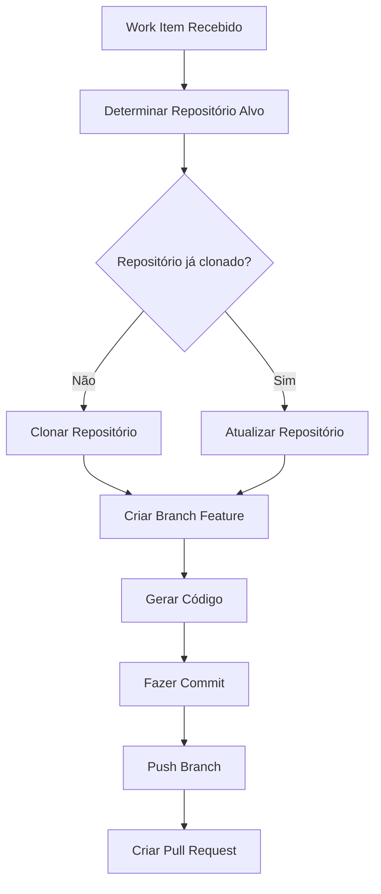

# Configuração de Repositórios - Redimento Code Generator

Este documento explica como configurar o gerenciamento de repositórios Git no Redimento Code Generator, incluindo o diretório base, clonagem automática e organização de arquivos.

## 📋 Índice

- [Visão Geral](#visão-geral)
- [REPOS_BASE_PATH](#repos_base_path)
- [Estrutura de Diretórios](#estrutura-de-diretórios)
- [Configuração por Ambiente](#configuração-por-ambiente)
- [Gerenciamento de Repositórios](#gerenciamento-de-repositórios)
- [Limpeza e Manutenção](#limpeza-e-manutenção)
- [Monitoramento](#monitoramento)
- [Troubleshooting](#troubleshooting)

## 🌐 Visão Geral

O Redimento Code Generator precisa clonar e modificar repositórios Git para gerar código automaticamente. O sistema gerencia múltiplos repositórios de forma organizada e eficiente.

### Como funciona o fluxo



### Benefícios da abordagem

- ✅ **Isolamento**: Cada repositório em diretório separado
- ✅ **Reutilização**: Repositórios são mantidos para próximos work items
- ✅ **Performance**: Evita clonagem desnecessária
- ✅ **Organização**: Estrutura clara e previsível
- ✅ **Limpeza**: Fácil manutenção e cleanup

## 📁 REPOS_BASE_PATH

### O que é

O **REPOS_BASE_PATH** é o diretório raiz onde todos os repositórios Git serão clonados e gerenciados pelo sistema.

```bash
# Configuração básica
REPOS_BASE_PATH=./repos
```

### Estrutura criada automaticamente

```
repos/                              # REPOS_BASE_PATH
├── meu-projeto-frontend/           # Repositório 1
│   ├── .git/                       # Controle de versão
│   ├── src/                        # Código fonte
│   ├── package.json               # Dependências
│   ├── .redimento/                # Metadados do sistema
│   │   ├── config.json            # Configuração específica
│   │   └── last-update.txt        # Última atualização
│   └── ...
├── meu-projeto-backend/            # Repositório 2
│   ├── .git/
│   ├── src/
│   ├── pom.xml
│   ├── .redimento/
│   └── ...
├── shared-components/              # Repositório 3
│   ├── .git/
│   ├── lib/
│   ├── .redimento/
│   └── ...
└── .metadata/                      # Metadados globais
    ├── repositories.json           # Lista de repositórios
    ├── cleanup.log                 # Log de limpeza
    └── stats.json                  # Estatísticas de uso
```

### Opções de configuração

#### Desenvolvimento Local
```bash
# Simples e organizado
REPOS_BASE_PATH=./repos

# Com caminho absoluto
REPOS_BASE_PATH=/home/usuario/redimento/repos
```

#### Docker/Container
```bash
# Dentro do container
REPOS_BASE_PATH=/app/repos

# Com volume montado
REPOS_BASE_PATH=/mnt/repos
```

#### Produção
```bash
# Diretório do sistema
REPOS_BASE_PATH=/var/lib/redimento/repositories

# Em storage dedicado
REPOS_BASE_PATH=/opt/redimento/repos

# Em volume de rede (NFS)
REPOS_BASE_PATH=/mnt/shared/redimento-repos
```

## 🏗️ Estrutura de Diretórios

### Organização por repositório

Cada repositório clonado segue esta estrutura:

```
{REPOS_BASE_PATH}/{nome-repositorio}/
├── .git/                           # Git metadata
├── {arquivos-do-projeto}/          # Código fonte original
├── .redimento/                     # Metadados do Redimento
│   ├── config.json                 # Configuração específica
│   ├── branches.json               # Histórico de branches
│   ├── workitems.json             # Work items processados
│   └── stats.json                  # Estatísticas
└── .gitignore                      # Ignora .redimento/
```

### Arquivo de configuração (.redimento/config.json)

```json
{
  "repositoryId": "repo-123",
  "name": "meu-projeto-frontend",
  "url": "https://github.com/empresa/meu-projeto-frontend.git",
  "defaultBranch": "main",
  "language": "typescript",
  "framework": "react",
  "lastCloned": "2024-01-30T10:00:00.000Z",
  "lastUpdated": "2024-01-30T15:30:00.000Z",
  "workItemsProcessed": 15,
  "branchesCreated": 12,
  "settings": {
    "autoCleanup": true,
    "maxBranches": 10,
    "cacheEnabled": true
  }
}
```

### Metadados globais (.metadata/repositories.json)

```json
{
  "repositories": [
    {
      "id": "repo-123",
      "name": "meu-projeto-frontend",
      "path": "./repos/meu-projeto-frontend",
      "url": "https://github.com/empresa/meu-projeto-frontend.git",
      "status": "active",
      "lastAccess": "2024-01-30T15:30:00.000Z",
      "diskUsage": "45.2 MB",
      "branchCount": 3
    },
    {
      "id": "repo-456", 
      "name": "meu-projeto-backend",
      "path": "./repos/meu-projeto-backend",
      "url": "https://github.com/empresa/meu-projeto-backend.git",
      "status": "active",
      "lastAccess": "2024-01-30T14:15:00.000Z",
      "diskUsage": "128.7 MB",
      "branchCount": 5
    }
  ],
  "totalRepositories": 2,
  "totalDiskUsage": "173.9 MB",
  "lastCleanup": "2024-01-29T02:00:00.000Z"
}
```

## ⚙️ Configuração por Ambiente

### Desenvolvimento

```bash
# .env.development
REPOS_BASE_PATH=./repos
REPOS_CLEANUP_ENABLED=false
REPOS_MAX_SIZE_MB=1024
REPOS_CACHE_ENABLED=true
```

**Características:**
- Diretório local simples
- Sem limpeza automática (para debugging)
- Cache habilitado para performance
- Limite de tamanho moderado

### Teste

```bash
# .env.test
REPOS_BASE_PATH=./test-repos
REPOS_CLEANUP_ENABLED=true
REPOS_CLEANUP_INTERVAL_HOURS=1
REPOS_MAX_SIZE_MB=512
REPOS_CACHE_ENABLED=false
```

**Características:**
- Diretório separado para testes
- Limpeza frequente
- Sem cache (para testes limpos)
- Limite menor de tamanho

### Produção

```bash
# .env.production
REPOS_BASE_PATH=/var/lib/redimento/repos
REPOS_CLEANUP_ENABLED=true
REPOS_CLEANUP_INTERVAL_HOURS=24
REPOS_MAX_SIZE_MB=5120
REPOS_CACHE_ENABLED=true
REPOS_BACKUP_ENABLED=true
REPOS_MONITORING_ENABLED=true
```

**Características:**
- Diretório do sistema
- Limpeza diária
- Cache habilitado
- Backup automático
- Monitoramento ativo

## 🔧 Gerenciamento de Repositórios

### Clonagem automática

```typescript
export class RepositoryManager {
  async ensureRepository(repositoryConfig: IRepositoryConfig): Promise<string> {
    const repoPath = path.join(this.basePath, repositoryConfig.name);
    
    if (await this.repositoryExists(repoPath)) {
      await this.updateRepository(repoPath);
      return repoPath;
    }
    
    return this.cloneRepository(repositoryConfig, repoPath);
  }
  
  private async cloneRepository(
    config: IRepositoryConfig, 
    targetPath: string
  ): Promise<string> {
    this.logger.info('Cloning repository', {
      name: config.name,
      url: config.url,
      targetPath
    });
    
    const git = simpleGit();
    await git.clone(config.url, targetPath, {
      '--depth': 1,
      '--single-branch': true,
      '--branch': config.defaultBranch
    });
    
    // Criar metadados
    await this.createRepositoryMetadata(targetPath, config);
    
    this.logger.info('Repository cloned successfully', {
      name: config.name,
      path: targetPath
    });
    
    return targetPath;
  }
}
```

### Atualização de repositórios

```typescript
private async updateRepository(repoPath: string): Promise<void> {
  const git = simpleGit(repoPath);
  
  try {
    // Voltar para branch principal
    const config = await this.getRepositoryConfig(repoPath);
    await git.checkout(config.defaultBranch);
    
    // Fazer pull das últimas mudanças
    await git.pull('origin', config.defaultBranch);
    
    // Atualizar metadados
    await this.updateRepositoryMetadata(repoPath);
    
    this.logger.info('Repository updated successfully', { repoPath });
    
  } catch (error) {
    this.logger.error('Failed to update repository', {
      repoPath,
      error: error.message
    });
    throw new RepositoryUpdateError(error.message);
  }
}
```

### Criação de branches

```typescript
async createWorkItemBranch(
  repoPath: string, 
  workItem: IWorkItem
): Promise<string> {
  const git = simpleGit(repoPath);
  const branchName = this.generateBranchName(workItem);
  
  try {
    // Garantir que estamos na branch principal atualizada
    const config = await this.getRepositoryConfig(repoPath);
    await git.checkout(config.defaultBranch);
    await git.pull('origin', config.defaultBranch);
    
    // Criar nova branch
    await git.checkoutLocalBranch(branchName);
    
    // Registrar branch nos metadados
    await this.registerBranch(repoPath, branchName, workItem);
    
    this.logger.info('Work item branch created', {
      repoPath,
      branchName,
      workItemId: workItem.id
    });
    
    return branchName;
    
  } catch (error) {
    this.logger.error('Failed to create work item branch', {
      repoPath,
      branchName,
      workItemId: workItem.id,
      error: error.message
    });
    throw new BranchCreationError(error.message);
  }
}

private generateBranchName(workItem: IWorkItem): string {
  const prefix = process.env.GIT_BRANCH_PREFIX || 'feat/';
  const sanitizedTitle = workItem.title
    .toLowerCase()
    .replace(/[^a-z0-9-]/g, '-')
    .replace(/-+/g, '-')
    .replace(/^-|-$/g, '')
    .substring(0, 50);
    
  return `${prefix}${workItem.id}_${sanitizedTitle}`;
}
```

## 🧹 Limpeza e Manutenção

### Configuração de limpeza

```bash
# Configurações de limpeza automática
REPOS_CLEANUP_ENABLED=true
REPOS_CLEANUP_INTERVAL_HOURS=24
REPOS_MAX_AGE_DAYS=7
REPOS_MAX_SIZE_MB=2048
REPOS_MAX_BRANCHES_PER_REPO=10
```

### Estratégias de limpeza

#### 1. Limpeza por idade

```typescript
export class RepositoryCleanup {
  async cleanupByAge(): Promise<void> {
    const maxAge = this.config.maxAgeDays * 24 * 60 * 60 * 1000;
    const repositories = await this.getRepositories();
    
    for (const repo of repositories) {
      const lastAccess = new Date(repo.lastAccess).getTime();
      
      if (Date.now() - lastAccess > maxAge) {
        await this.removeRepository(repo.path);
        this.logger.info('Repository removed due to age', {
          name: repo.name,
          lastAccess: repo.lastAccess
        });
      }
    }
  }
}
```

#### 2. Limpeza por tamanho

```typescript
async cleanupBySize(): Promise<void> {
  const maxSize = this.config.maxSizeMB * 1024 * 1024;
  let totalSize = await this.getTotalSize();
  
  if (totalSize <= maxSize) return;
  
  // Ordenar por último acesso (mais antigos primeiro)
  const repositories = await this.getRepositoriesByLastAccess();
  
  for (const repo of repositories) {
    if (totalSize <= maxSize) break;
    
    const repoSize = await this.getRepositorySize(repo.path);
    await this.removeRepository(repo.path);
    totalSize -= repoSize;
    
    this.logger.info('Repository removed due to size limit', {
      name: repo.name,
      size: `${(repoSize / 1024 / 1024).toFixed(2)} MB`
    });
  }
}
```

#### 3. Limpeza de branches antigas

```typescript
async cleanupOldBranches(repoPath: string): Promise<void> {
  const git = simpleGit(repoPath);
  const maxBranches = this.config.maxBranchesPerRepo;
  
  const branches = await git.branchLocal();
  const featureBranches = branches.all.filter(b => 
    b.startsWith('feat/') && b !== branches.current
  );
  
  if (featureBranches.length <= maxBranches) return;
  
  // Remover branches mais antigas
  const branchesToRemove = featureBranches
    .slice(0, featureBranches.length - maxBranches);
    
  for (const branch of branchesToRemove) {
    await git.deleteLocalBranch(branch, true);
    this.logger.info('Old branch removed', {
      repoPath,
      branch
    });
  }
}
```

### Agendamento de limpeza

```typescript
export class CleanupScheduler {
  private intervalId: NodeJS.Timeout | null = null;
  
  start(): void {
    if (!this.config.cleanupEnabled) return;
    
    const intervalMs = this.config.cleanupIntervalHours * 60 * 60 * 1000;
    
    this.intervalId = setInterval(async () => {
      try {
        await this.runCleanup();
      } catch (error) {
        this.logger.error('Cleanup failed', { error: error.message });
      }
    }, intervalMs);
    
    this.logger.info('Cleanup scheduler started', {
      intervalHours: this.config.cleanupIntervalHours
    });
  }
  
  private async runCleanup(): Promise<void> {
    this.logger.info('Starting scheduled cleanup');
    
    const cleanup = new RepositoryCleanup(this.config);
    
    await cleanup.cleanupByAge();
    await cleanup.cleanupBySize();
    await cleanup.cleanupOldBranches();
    
    // Atualizar estatísticas
    await this.updateCleanupStats();
    
    this.logger.info('Scheduled cleanup completed');
  }
}
```

## 📊 Monitoramento

### Métricas de repositórios

```typescript
export class RepositoryMetrics {
  async collectMetrics(): Promise<IRepositoryMetrics> {
    const repositories = await this.getRepositories();
    
    return {
      totalRepositories: repositories.length,
      totalDiskUsage: await this.getTotalDiskUsage(),
      averageRepositorySize: await this.getAverageRepositorySize(),
      oldestRepository: await this.getOldestRepository(),
      newestRepository: await this.getNewestRepository(),
      totalBranches: await this.getTotalBranches(),
      repositoriesByLanguage: await this.getRepositoriesByLanguage(),
      diskUsageByRepository: await this.getDiskUsageByRepository()
    };
  }
}
```

### Dashboard de monitoramento

```typescript
// Endpoint para métricas
app.get('/admin/repositories/metrics', async (req, res) => {
  const metrics = await repositoryMetrics.collectMetrics();
  
  res.json({
    timestamp: new Date().toISOString(),
    metrics: {
      repositories: {
        total: metrics.totalRepositories,
        diskUsage: `${(metrics.totalDiskUsage / 1024 / 1024).toFixed(2)} MB`,
        averageSize: `${(metrics.averageRepositorySize / 1024 / 1024).toFixed(2)} MB`
      },
      activity: {
        oldestAccess: metrics.oldestRepository?.lastAccess,
        newestAccess: metrics.newestRepository?.lastAccess,
        totalBranches: metrics.totalBranches
      },
      breakdown: {
        byLanguage: metrics.repositoriesByLanguage,
        bySize: metrics.diskUsageByRepository
      }
    }
  });
});
```

### Alertas automáticos

```typescript
export class RepositoryAlerts {
  async checkAlerts(): Promise<void> {
    const metrics = await this.repositoryMetrics.collectMetrics();
    
    // Alerta de espaço em disco
    if (metrics.totalDiskUsage > this.config.diskUsageThreshold) {
      await this.sendAlert('DISK_USAGE_HIGH', {
        current: metrics.totalDiskUsage,
        threshold: this.config.diskUsageThreshold,
        message: 'Repository disk usage is above threshold'
      });
    }
    
    // Alerta de repositórios órfãos
    const orphanedRepos = await this.findOrphanedRepositories();
    if (orphanedRepos.length > 0) {
      await this.sendAlert('ORPHANED_REPOSITORIES', {
        count: orphanedRepos.length,
        repositories: orphanedRepos,
        message: 'Found repositories without recent activity'
      });
    }
  }
}
```

## 🔍 Troubleshooting

### Problemas comuns

#### 1. Diretório não pode ser criado

**Sintoma:**
```
Error: EACCES: permission denied, mkdir './repos'
```

**Diagnóstico:**
```bash
# Verificar permissões do diretório pai
ls -la ./

# Verificar usuário atual
whoami

# Verificar espaço em disco
df -h .
```

**Solução:**
```bash
# Criar diretório manualmente
mkdir -p ./repos
chmod 755 ./repos

# Ou alterar proprietário
sudo chown -R $USER:$USER ./repos
```

#### 2. Falha na clonagem de repositório

**Sintoma:**
```
Error: Repository clone failed - Authentication failed
```

**Diagnóstico:**
```bash
# Testar acesso manual
git clone https://github.com/empresa/repo.git test-clone

# Verificar credenciais
git config --list | grep credential

# Testar conectividade
ping github.com
```

**Solução:**
```bash
# Configurar credenciais Git
git config --global credential.helper store

# Ou usar SSH keys
ssh-keygen -t rsa -b 4096 -C "redimento@empresa.com"
ssh-add ~/.ssh/id_rsa

# Adicionar chave ao GitHub/Azure DevOps
```

#### 3. Repositório corrompido

**Sintoma:**
```
Error: Git operation failed - not a git repository
```

**Diagnóstico:**
```bash
# Verificar integridade do repositório
cd ./repos/meu-projeto
git fsck

# Verificar status
git status
```

**Solução:**
```bash
# Remover e reclonar repositório
rm -rf ./repos/meu-projeto
# Sistema irá reclonar automaticamente na próxima execução

# Ou reparar repositório
cd ./repos/meu-projeto
git gc --prune=now
git remote prune origin
```

#### 4. Espaço em disco insuficiente

**Sintoma:**
```
Error: ENOSPC: no space left on device
```

**Diagnóstico:**
```bash
# Verificar espaço disponível
df -h

# Verificar tamanho dos repositórios
du -sh ./repos/*

# Encontrar arquivos grandes
find ./repos -type f -size +100M
```

**Solução:**
```bash
# Executar limpeza manual
npm run cleanup:repositories

# Ou configurar limpeza automática
REPOS_CLEANUP_ENABLED=true
REPOS_MAX_SIZE_MB=1024

# Mover para diretório com mais espaço
REPOS_BASE_PATH=/mnt/storage/repos
```

### Comandos de diagnóstico

```bash
# Status geral dos repositórios
curl http://localhost:3000/admin/repositories/status

# Métricas detalhadas
curl http://localhost:3000/admin/repositories/metrics

# Listar repositórios
ls -la ./repos/

# Verificar tamanhos
du -sh ./repos/*

# Verificar branches ativas
find ./repos -name ".git" -exec sh -c 'cd "$(dirname "{}")" && echo "=== $(basename "$(pwd)") ===" && git branch' \;

# Verificar último acesso
find ./repos -type d -name ".git" -exec stat -c "%Y %n" {} \; | sort -n

# Logs de operações Git
grep -i "git\|repository\|branch" logs/app.log | tail -20
```

### Script de manutenção

```bash
#!/bin/bash
# maintenance.sh - Script de manutenção dos repositórios

REPOS_PATH="./repos"
LOG_FILE="./logs/maintenance.log"

echo "$(date): Starting repository maintenance" >> $LOG_FILE

# Verificar espaço em disco
DISK_USAGE=$(df . | tail -1 | awk '{print $5}' | sed 's/%//')
if [ $DISK_USAGE -gt 80 ]; then
    echo "$(date): WARNING - Disk usage is ${DISK_USAGE}%" >> $LOG_FILE
fi

# Verificar repositórios órfãos
find $REPOS_PATH -maxdepth 1 -type d -mtime +7 | while read dir; do
    if [ -d "$dir/.git" ]; then
        echo "$(date): Found old repository: $dir" >> $LOG_FILE
    fi
done

# Verificar integridade dos repositórios
find $REPOS_PATH -name ".git" -type d | while read git_dir; do
    repo_dir=$(dirname "$git_dir")
    cd "$repo_dir"
    
    if ! git fsck --quiet 2>/dev/null; then
        echo "$(date): Repository integrity issue: $repo_dir" >> $LOG_FILE
    fi
done

echo "$(date): Repository maintenance completed" >> $LOG_FILE
```

---

*Última atualização: Janeiro 2024*
*Versão do documento: 1.0*