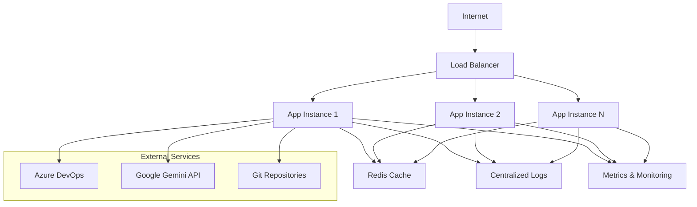

# Guia de Deploy - Redimento Code Generator

Este documento fornece instruções completas para fazer deploy do Redimento Code Generator em diferentes ambientes de produção.

## 📋 Índice

- [Visão Geral](#visão-geral)
- [Pré-requisitos](#pré-requisitos)
- [Ambientes Suportados](#ambientes-suportados)
- [Deploy Local (Docker)](#deploy-local-docker)
- [Deploy em Cloud (Azure)](#deploy-em-cloud-azure)
- [Deploy em Cloud (AWS)](#deploy-em-cloud-aws)
- [Deploy em Kubernetes](#deploy-em-kubernetes)
- [Configuração de Produção](#configuração-de-produção)
- [Monitoramento](#monitoramento)
- [Backup e Recuperação](#backup-e-recuperação)
- [Troubleshooting](#troubleshooting)

## 🌐 Visão Geral

O Redimento Code Generator pode ser deployado em diversos ambientes:

- **Docker Container** - Para desenvolvimento e testes
- **Azure App Service** - Integração nativa com Azure DevOps
- **AWS ECS/Fargate** - Escalabilidade automática
- **Kubernetes** - Orquestração avançada
- **VM/Servidor Dedicado** - Controle total

### Arquitetura de Deploy



## 🔧 Pré-requisitos

### Recursos Mínimos

| Ambiente | CPU | RAM | Disco | Rede |
|----------|-----|-----|-------|------|
| **Desenvolvimento** | 1 vCPU | 1 GB | 10 GB | 1 Mbps |
| **Teste** | 2 vCPU | 2 GB | 20 GB | 10 Mbps |
| **Produção** | 4 vCPU | 4 GB | 50 GB | 100 Mbps |

### Software Necessário

- **Node.js** 18.0+ (LTS recomendado)
- **Docker** 20.0+ (para containerização)
- **Git** 2.30+ (para operações de repositório)
- **SSL Certificate** (para HTTPS em produção)

### Credenciais e Configurações

- ✅ Azure DevOps Personal Access Token
- ✅ Google Gemini API Key
- ✅ Webhook Secret configurado
- ✅ Certificados SSL (produção)
- ✅ Domínio configurado (produção)

## 🐳 Deploy Local (Docker)

### 1. Dockerfile

O projeto já inclui um `Dockerfile` otimizado:

```dockerfile
# Build stage
FROM node:18-alpine AS builder

WORKDIR /app
COPY package*.json ./
RUN npm ci --only=production

COPY . .
RUN npm run build

# Production stage
FROM node:18-alpine AS production

RUN addgroup -g 1001 -S nodejs
RUN adduser -S nodejs -u 1001

WORKDIR /app

COPY --from=builder --chown=nodejs:nodejs /app/dist ./dist
COPY --from=builder --chown=nodejs:nodejs /app/node_modules ./node_modules
COPY --from=builder --chown=nodejs:nodejs /app/package.json ./package.json

USER nodejs

EXPOSE 3000

HEALTHCHECK --interval=30s --timeout=3s --start-period=5s --retries=3 \
  CMD curl -f http://localhost:3000/health || exit 1

CMD ["node", "dist/app.js"]
```

### 2. Docker Compose

Para ambiente completo com dependências:

```yaml
# docker-compose.yml
version: '3.8'

services:
  app:
    build: .
    ports:
      - "3000:3000"
    environment:
      - NODE_ENV=production
      - PORT=3000
      - REDIS_URL=redis://redis:6379
    env_file:
      - .env.production
    depends_on:
      - redis
    restart: unless-stopped
    healthcheck:
      test: ["CMD", "curl", "-f", "http://localhost:3000/health"]
      interval: 30s
      timeout: 10s
      retries: 3
      start_period: 40s

  redis:
    image: redis:7-alpine
    ports:
      - "6379:6379"
    volumes:
      - redis_data:/data
    restart: unless-stopped
    healthcheck:
      test: ["CMD", "redis-cli", "ping"]
      interval: 30s
      timeout: 3s
      retries: 3

  nginx:
    image: nginx:alpine
    ports:
      - "80:80"
      - "443:443"
    volumes:
      - ./nginx.conf:/etc/nginx/nginx.conf
      - ./ssl:/etc/nginx/ssl
    depends_on:
      - app
    restart: unless-stopped

volumes:
  redis_data:
```

### 3. Comandos de Deploy

```bash
# Build da imagem
docker build -t redimento-code-generator .

# Deploy com Docker Compose
docker-compose up -d

# Verificar status
docker-compose ps

# Ver logs
docker-compose logs -f app

# Parar serviços
docker-compose down
```

## ☁️ Deploy em Cloud (Azure)

### 1. Azure App Service

#### Configuração via Azure CLI

```bash
# Login no Azure
az login

# Criar Resource Group
az group create --name rg-redimento --location "East US"

# Criar App Service Plan
az appservice plan create \
  --name plan-redimento \
  --resource-group rg-redimento \
  --sku B1 \
  --is-linux

# Criar Web App
az webapp create \
  --resource-group rg-redimento \
  --plan plan-redimento \
  --name redimento-code-generator \
  --runtime "NODE|18-lts"

# Configurar variáveis de ambiente
az webapp config appsettings set \
  --resource-group rg-redimento \
  --name redimento-code-generator \
  --settings \
    NODE_ENV=production \
    AZURE_DEVOPS_ORG_URL="https://dev.azure.com/sua-org" \
    AZURE_DEVOPS_TOKEN="@Microsoft.KeyVault(SecretUri=https://kv-redimento.vault.azure.net/secrets/azure-devops-token/)" \
    GEMINI_API_KEY="@Microsoft.KeyVault(SecretUri=https://kv-redimento.vault.azure.net/secrets/gemini-api-key/)"

# Deploy do código
az webapp deployment source config \
  --resource-group rg-redimento \
  --name redimento-code-generator \
  --repo-url https://github.com/sua-org/redimento-code-generator \
  --branch main \
  --manual-integration
```

#### Azure Resource Manager Template

```json
{
  "$schema": "https://schema.management.azure.com/schemas/2019-04-01/deploymentTemplate.json#",
  "contentVersion": "1.0.0.0",
  "parameters": {
    "appName": {
      "type": "string",
      "defaultValue": "redimento-code-generator"
    },
    "location": {
      "type": "string",
      "defaultValue": "[resourceGroup().location]"
    }
  },
  "resources": [
    {
      "type": "Microsoft.Web/serverfarms",
      "apiVersion": "2021-02-01",
      "name": "[concat(parameters('appName'), '-plan')]",
      "location": "[parameters('location')]",
      "sku": {
        "name": "B1",
        "tier": "Basic"
      },
      "kind": "linux",
      "properties": {
        "reserved": true
      }
    },
    {
      "type": "Microsoft.Web/sites",
      "apiVersion": "2021-02-01",
      "name": "[parameters('appName')]",
      "location": "[parameters('location')]",
      "dependsOn": [
        "[resourceId('Microsoft.Web/serverfarms', concat(parameters('appName'), '-plan'))]"
      ],
      "properties": {
        "serverFarmId": "[resourceId('Microsoft.Web/serverfarms', concat(parameters('appName'), '-plan'))]",
        "siteConfig": {
          "linuxFxVersion": "NODE|18-lts",
          "appSettings": [
            {
              "name": "NODE_ENV",
              "value": "production"
            },
            {
              "name": "WEBSITES_PORT",
              "value": "3000"
            }
          ]
        }
      }
    }
  ]
}
```

### 2. Azure Container Instances

```bash
# Criar Container Registry
az acr create \
  --resource-group rg-redimento \
  --name acrredimento \
  --sku Basic

# Build e push da imagem
az acr build \
  --registry acrredimento \
  --image redimento-code-generator:latest .

# Deploy do container
az container create \
  --resource-group rg-redimento \
  --name redimento-app \
  --image acrredimento.azurecr.io/redimento-code-generator:latest \
  --cpu 2 \
  --memory 4 \
  --ports 3000 \
  --dns-name-label redimento-code-generator \
  --environment-variables \
    NODE_ENV=production \
  --secure-environment-variables \
    AZURE_DEVOPS_TOKEN=seu-token \
    GEMINI_API_KEY=sua-chave
```

## 🚀 Deploy em Cloud (AWS)

### 1. AWS ECS Fargate

#### Task Definition

```json
{
  "family": "redimento-code-generator",
  "networkMode": "awsvpc",
  "requiresCompatibilities": ["FARGATE"],
  "cpu": "1024",
  "memory": "2048",
  "executionRoleArn": "arn:aws:iam::account:role/ecsTaskExecutionRole",
  "taskRoleArn": "arn:aws:iam::account:role/ecsTaskRole",
  "containerDefinitions": [
    {
      "name": "redimento-app",
      "image": "account.dkr.ecr.region.amazonaws.com/redimento-code-generator:latest",
      "portMappings": [
        {
          "containerPort": 3000,
          "protocol": "tcp"
        }
      ],
      "environment": [
        {
          "name": "NODE_ENV",
          "value": "production"
        }
      ],
      "secrets": [
        {
          "name": "AZURE_DEVOPS_TOKEN",
          "valueFrom": "arn:aws:secretsmanager:region:account:secret:azure-devops-token"
        },
        {
          "name": "GEMINI_API_KEY",
          "valueFrom": "arn:aws:secretsmanager:region:account:secret:gemini-api-key"
        }
      ],
      "logConfiguration": {
        "logDriver": "awslogs",
        "options": {
          "awslogs-group": "/ecs/redimento-code-generator",
          "awslogs-region": "us-east-1",
          "awslogs-stream-prefix": "ecs"
        }
      },
      "healthCheck": {
        "command": [
          "CMD-SHELL",
          "curl -f http://localhost:3000/health || exit 1"
        ],
        "interval": 30,
        "timeout": 5,
        "retries": 3,
        "startPeriod": 60
      }
    }
  ]
}
```

#### Deploy via AWS CLI

```bash
# Criar ECR Repository
aws ecr create-repository --repository-name redimento-code-generator

# Build e push da imagem
aws ecr get-login-password --region us-east-1 | docker login --username AWS --password-stdin account.dkr.ecr.us-east-1.amazonaws.com

docker build -t redimento-code-generator .
docker tag redimento-code-generator:latest account.dkr.ecr.us-east-1.amazonaws.com/redimento-code-generator:latest
docker push account.dkr.ecr.us-east-1.amazonaws.com/redimento-code-generator:latest

# Registrar Task Definition
aws ecs register-task-definition --cli-input-json file://task-definition.json

# Criar ECS Service
aws ecs create-service \
  --cluster redimento-cluster \
  --service-name redimento-service \
  --task-definition redimento-code-generator:1 \
  --desired-count 2 \
  --launch-type FARGATE \
  --network-configuration "awsvpcConfiguration={subnets=[subnet-12345,subnet-67890],securityGroups=[sg-abcdef],assignPublicIp=ENABLED}"
```

### 2. AWS Lambda (Serverless)

Para processamento baseado em eventos:

```javascript
// lambda/handler.js
const { processWorkItem } = require('./src/services/workItem');

exports.handler = async (event) => {
  try {
    // Parse webhook payload
    const payload = JSON.parse(event.body);
    
    // Process work item
    const result = await processWorkItem(payload);
    
    return {
      statusCode: 200,
      body: JSON.stringify({
        success: true,
        data: result
      })
    };
  } catch (error) {
    console.error('Error processing webhook:', error);
    
    return {
      statusCode: 500,
      body: JSON.stringify({
        success: false,
        error: error.message
      })
    };
  }
};
```

```yaml
# serverless.yml
service: redimento-code-generator

provider:
  name: aws
  runtime: nodejs18.x
  region: us-east-1
  environment:
    NODE_ENV: production
    AZURE_DEVOPS_TOKEN: ${ssm:/redimento/azure-devops-token}
    GEMINI_API_KEY: ${ssm:/redimento/gemini-api-key}

functions:
  webhook:
    handler: lambda/handler.handler
    events:
      - http:
          path: webhook/workitem
          method: post
    timeout: 300
    memorySize: 1024

plugins:
  - serverless-offline
```

## ⚙️ Deploy em Kubernetes

### 1. Manifests Kubernetes

#### Deployment

```yaml
# k8s/deployment.yaml
apiVersion: apps/v1
kind: Deployment
metadata:
  name: redimento-code-generator
  labels:
    app: redimento-code-generator
spec:
  replicas: 3
  selector:
    matchLabels:
      app: redimento-code-generator
  template:
    metadata:
      labels:
        app: redimento-code-generator
    spec:
      containers:
      - name: app
        image: redimento-code-generator:latest
        ports:
        - containerPort: 3000
        env:
        - name: NODE_ENV
          value: "production"
        - name: PORT
          value: "3000"
        envFrom:
        - secretRef:
            name: redimento-secrets
        resources:
          requests:
            memory: "512Mi"
            cpu: "250m"
          limits:
            memory: "1Gi"
            cpu: "500m"
        livenessProbe:
          httpGet:
            path: /health
            port: 3000
          initialDelaySeconds: 30
          periodSeconds: 10
        readinessProbe:
          httpGet:
            path: /health
            port: 3000
          initialDelaySeconds: 5
          periodSeconds: 5
```

#### Service

```yaml
# k8s/service.yaml
apiVersion: v1
kind: Service
metadata:
  name: redimento-service
spec:
  selector:
    app: redimento-code-generator
  ports:
  - protocol: TCP
    port: 80
    targetPort: 3000
  type: ClusterIP
```

#### Ingress

```yaml
# k8s/ingress.yaml
apiVersion: networking.k8s.io/v1
kind: Ingress
metadata:
  name: redimento-ingress
  annotations:
    kubernetes.io/ingress.class: nginx
    cert-manager.io/cluster-issuer: letsencrypt-prod
    nginx.ingress.kubernetes.io/rate-limit: "100"
spec:
  tls:
  - hosts:
    - redimento.suaempresa.com
    secretName: redimento-tls
  rules:
  - host: redimento.suaempresa.com
    http:
      paths:
      - path: /
        pathType: Prefix
        backend:
          service:
            name: redimento-service
            port:
              number: 80
```

#### Secrets

```yaml
# k8s/secrets.yaml
apiVersion: v1
kind: Secret
metadata:
  name: redimento-secrets
type: Opaque
data:
  AZURE_DEVOPS_TOKEN: <base64-encoded-token>
  GEMINI_API_KEY: <base64-encoded-key>
  WEBHOOK_SECRET: <base64-encoded-secret>
```

### 2. Deploy Commands

```bash
# Aplicar manifests
kubectl apply -f k8s/

# Verificar status
kubectl get pods -l app=redimento-code-generator
kubectl get services
kubectl get ingress

# Ver logs
kubectl logs -l app=redimento-code-generator -f

# Escalar aplicação
kubectl scale deployment redimento-code-generator --replicas=5

# Atualizar imagem
kubectl set image deployment/redimento-code-generator app=redimento-code-generator:v2.0.0
```

## 🔧 Configuração de Produção

### 1. Variáveis de Ambiente

```bash
# .env.production
NODE_ENV=production
PORT=3000

# Azure DevOps
AZURE_DEVOPS_ORG_URL=https://dev.azure.com/sua-organizacao
AZURE_DEVOPS_TOKEN=seu-token-producao
AZURE_DEVOPS_PROJECT=projeto-producao

# Webhook
WEBHOOK_SECRET=chave-secreta-super-forte-producao

# Google Gemini
GEMINI_API_KEY=chave-api-gemini-producao
GEMINI_MODEL=gemini-pro

# Git
GIT_USER_NAME=Redimento Code Generator
GIT_USER_EMAIL=redimento@suaempresa.com
GIT_DEFAULT_BRANCH=main

# Repositórios
REPOS_BASE_PATH=/app/repos
DEFAULT_REVIEWERS=dev-lead@empresa.com,arquiteto@empresa.com

# Logging
LOG_LEVEL=info
LOG_FILE=/app/logs/app.log

# Performance
MAX_RETRY_ATTEMPTS=3
RETRY_BASE_DELAY=1000
RETRY_MAX_DELAY=10000
HEALTH_CHECK_TIMEOUT=5000

# Segurança
API_KEY=chave-api-super-secreta-producao

# Cache (Redis)
REDIS_URL=redis://redis-cluster:6379
CACHE_TTL=3600

# Monitoramento
METRICS_ENABLED=true
METRICS_PORT=9090
```

### 2. Nginx Configuration

```nginx
# nginx.conf
upstream app {
    server app:3000;
}

server {
    listen 80;
    server_name redimento.suaempresa.com;
    return 301 https://$server_name$request_uri;
}

server {
    listen 443 ssl http2;
    server_name redimento.suaempresa.com;

    ssl_certificate /etc/nginx/ssl/cert.pem;
    ssl_certificate_key /etc/nginx/ssl/key.pem;
    ssl_protocols TLSv1.2 TLSv1.3;
    ssl_ciphers ECDHE-RSA-AES256-GCM-SHA512:DHE-RSA-AES256-GCM-SHA512;

    # Rate limiting
    limit_req_zone $binary_remote_addr zone=webhook:10m rate=10r/m;
    limit_req_zone $binary_remote_addr zone=api:10m rate=60r/m;

    # Webhook endpoint
    location /webhook {
        limit_req zone=webhook burst=5 nodelay;
        proxy_pass http://app;
        proxy_set_header Host $host;
        proxy_set_header X-Real-IP $remote_addr;
        proxy_set_header X-Forwarded-For $proxy_add_x_forwarded_for;
        proxy_set_header X-Forwarded-Proto $scheme;
        proxy_timeout 30s;
    }

    # API endpoints
    location / {
        limit_req zone=api burst=20 nodelay;
        proxy_pass http://app;
        proxy_set_header Host $host;
        proxy_set_header X-Real-IP $remote_addr;
        proxy_set_header X-Forwarded-For $proxy_add_x_forwarded_for;
        proxy_set_header X-Forwarded-Proto $scheme;
    }

    # Health check (sem rate limit)
    location /health {
        proxy_pass http://app;
        access_log off;
    }
}
```

## 📊 Monitoramento

### 1. Prometheus Metrics

```javascript
// src/middleware/metrics.js
const promClient = require('prom-client');

const httpRequestDuration = new promClient.Histogram({
  name: 'http_request_duration_seconds',
  help: 'Duration of HTTP requests in seconds',
  labelNames: ['method', 'route', 'status_code']
});

const webhooksReceived = new promClient.Counter({
  name: 'webhooks_received_total',
  help: 'Total number of webhooks received',
  labelNames: ['event_type']
});

const workItemsProcessed = new promClient.Counter({
  name: 'work_items_processed_total',
  help: 'Total number of work items processed',
  labelNames: ['status', 'work_item_type']
});

module.exports = {
  httpRequestDuration,
  webhooksReceived,
  workItemsProcessed,
  register: promClient.register
};
```

### 2. Grafana Dashboard

```json
{
  "dashboard": {
    "title": "Redimento Code Generator",
    "panels": [
      {
        "title": "Request Rate",
        "type": "graph",
        "targets": [
          {
            "expr": "rate(http_requests_total[5m])",
            "legendFormat": "{{method}} {{route}}"
          }
        ]
      },
      {
        "title": "Work Items Processed",
        "type": "singlestat",
        "targets": [
          {
            "expr": "increase(work_items_processed_total[1h])",
            "legendFormat": "Last Hour"
          }
        ]
      },
      {
        "title": "Error Rate",
        "type": "graph",
        "targets": [
          {
            "expr": "rate(http_requests_total{status_code=~\"5..\"}[5m])",
            "legendFormat": "5xx Errors"
          }
        ]
      }
    ]
  }
}
```

### 3. Health Checks

```bash
# Script de monitoramento
#!/bin/bash
# monitor.sh

ENDPOINT="https://redimento.suaempresa.com/health"
WEBHOOK_URL="https://hooks.slack.com/services/YOUR/SLACK/WEBHOOK"

response=$(curl -s -o /dev/null -w "%{http_code}" $ENDPOINT)

if [ $response -ne 200 ]; then
    curl -X POST -H 'Content-type: application/json' \
        --data '{"text":"🚨 Redimento Code Generator está fora do ar!"}' \
        $WEBHOOK_URL
fi
```

## 💾 Backup e Recuperação

### 1. Backup de Configurações

```bash
#!/bin/bash
# backup.sh

BACKUP_DIR="/backups/$(date +%Y%m%d)"
mkdir -p $BACKUP_DIR

# Backup de configurações
cp .env.production $BACKUP_DIR/
cp -r k8s/ $BACKUP_DIR/
cp docker-compose.yml $BACKUP_DIR/

# Backup de logs
tar -czf $BACKUP_DIR/logs.tar.gz logs/

# Upload para S3
aws s3 sync $BACKUP_DIR s3://redimento-backups/$(date +%Y%m%d)/
```

### 2. Disaster Recovery

```bash
#!/bin/bash
# restore.sh

BACKUP_DATE=$1
BACKUP_DIR="/backups/$BACKUP_DATE"

if [ ! -d "$BACKUP_DIR" ]; then
    echo "Backup não encontrado para a data: $BACKUP_DATE"
    exit 1
fi

# Restaurar configurações
cp $BACKUP_DIR/.env.production .
cp -r $BACKUP_DIR/k8s/ .

# Redeployar aplicação
kubectl apply -f k8s/
kubectl rollout restart deployment/redimento-code-generator

echo "Restore concluído para a data: $BACKUP_DATE"
```

## 🔍 Troubleshooting

### Problemas Comuns

#### 1. Container não inicia

```bash
# Verificar logs
docker logs redimento-app

# Verificar configurações
docker exec -it redimento-app env | grep -E "(AZURE|GEMINI)"

# Testar conectividade
docker exec -it redimento-app curl -f http://localhost:3000/health
```

#### 2. Alta latência

```bash
# Verificar recursos
kubectl top pods -l app=redimento-code-generator

# Verificar métricas
curl http://redimento.suaempresa.com:9090/metrics

# Escalar horizontalmente
kubectl scale deployment redimento-code-generator --replicas=5
```

#### 3. Falhas de webhook

```bash
# Verificar logs de webhook
kubectl logs -l app=redimento-code-generator | grep webhook

# Testar assinatura
echo -n "payload" | openssl dgst -sha256 -hmac "webhook-secret"

# Verificar rate limiting
curl -I https://redimento.suaempresa.com/webhook/workitem
```

### Comandos de Diagnóstico

```bash
# Status geral do sistema
kubectl get all -l app=redimento-code-generator

# Logs em tempo real
kubectl logs -f deployment/redimento-code-generator

# Métricas de recursos
kubectl describe pod <pod-name>

# Teste de conectividade
kubectl exec -it <pod-name> -- curl -f http://localhost:3000/health

# Verificar secrets
kubectl get secrets redimento-secrets -o yaml
```

---

*Última atualização: Janeiro 2024*
*Versão do documento: 1.0*